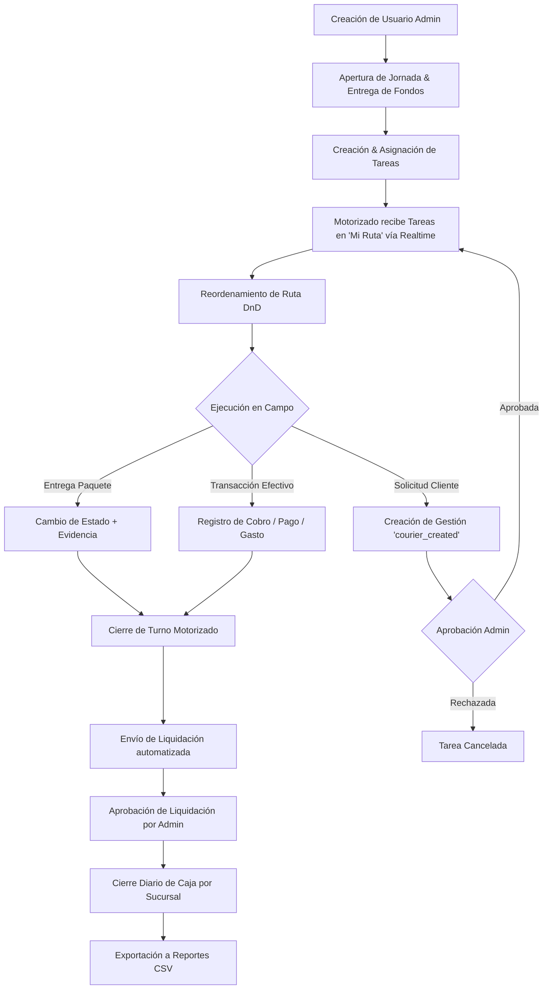
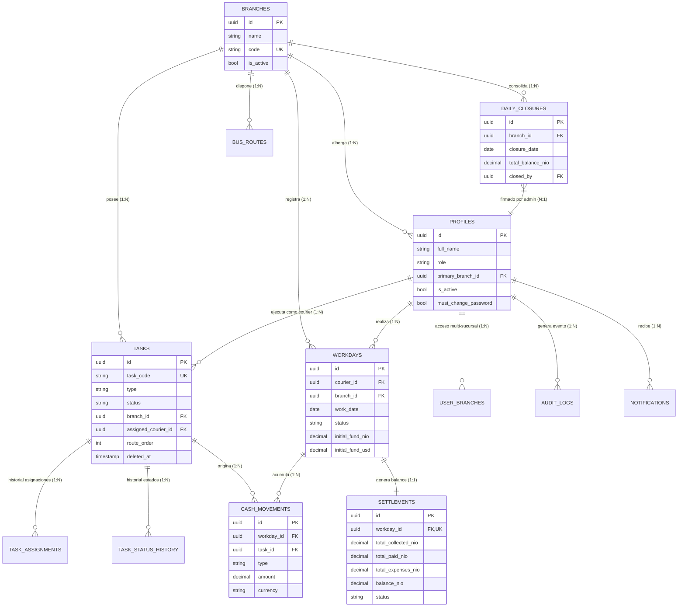

# BRICKLAR_MASTER_PLAN.md
# Documento Rector del Proyecto — Fuente Oficial de Verdad

---

## Historial de Versiones

| Versión | Fecha | Autor | Cambios |
|---------|-------|-------|---------|
| 1.0.0 | 2026-08-07 | Auditoría Inicial | Creación del documento maestro consolidando PROJECT_AUDIT_REPORT, PROJECT_STATUS, MASTER_BACKLOG, SPRINT_PLANNING, PRODUCTION_CHECKLIST, VISION, ARCHITECTURE, DESIGN_SYSTEM. |
| 1.1.0 | 2026-08-07 | Consolidación Enterprise | Adición de Gobernanza del Proyecto, Reglas de Negocio exhaustivas, Modelo de Datos ER (Mermaid), Columna de Estado en Decisiones Arquitectónicas, Tabla estructurada de Roadmap, Reordenamiento estricto de Próximos Pasos y corrección de enlaces internos. |

---

> **Versión:** 1.1.0  
> **Fecha de actualización:** 2026-08-07  
> **Estado del proyecto:** EN DESARROLLO ACTIVO — Build Bloqueado (~57% listo para producción)  
> **Última auditoría:** 2026-08-06  

> [!IMPORTANT]
> **Este documento es la referencia oficial y fuente única de verdad del proyecto Bricklar Gestor.**
> Todo desarrollador o subagente de IA que participe en el proyecto debe leerlo y acatarlo obligatoriamente antes de ejecutar cualquier propuesta o cambio.
> Los documentos fuente secundarios NO deben eliminarse — este documento actúa como consolidación e índice maestro.

---

## ÍNDICE

1. [Visión del Proyecto](#1-visión-del-proyecto)
2. [Gobernanza del Proyecto](#2-gobernanza-del-proyecto)
3. [Arquitectura](#3-arquitectura)
4. [Roles](#4-roles)
5. [Flujo Operativo](#5-flujo-operativo)
6. [Reglas de Negocio](#6-reglas-de-negocio)
7. [Modelo de Datos](#7-modelo-de-datos)
8. [Módulos](#8-módulos)
9. [Base de Datos](#9-base-de-datos)
10. [UX/UI y Design System](#10-uxui-y-design-system)
11. [Funcionalidades Implementadas](#11-funcionalidades-implementadas)
12. [Backlog Maestro](#12-backlog-maestro)
13. [Roadmap](#13-roadmap)
14. [Sprint Planning](#14-sprint-planning)
15. [Riesgos](#15-riesgos)
16. [Producción](#16-producción)
17. [Convenciones](#17-convenciones)
18. [Decisiones Arquitectónicas](#18-decisiones-arquitectónicas)
19. [Próximos Pasos](#19-próximos-pasos)
20. [Referencias Cruzadas](#20-referencias-cruzadas)

---

## 1. Visión del Proyecto

### 1.1 Qué es Bricklar Gestor

**Bricklar Gestor** es una aplicación web SaaS de gestión operativa y financiera para empresas de mensajería y entregas en Nicaragua. Permite a administradores gestionar en tiempo real la operación diaria de un equipo de motorizados (repartidores), incluyendo asignación de tareas, control de fondos, liquidaciones y cierre de caja diario.

### 1.2 Problema que Resuelve

Las empresas de mensajería en Nicaragua gestionan sus operaciones tradicionalmente con hojas de cálculo, chats de WhatsApp y registros manuales en papel. Esto genera:

- Falta de trazabilidad en cobros y pagos en campo.
- Descuadres de caja frecuentes al cierre del día.
- Imposibilidad de supervisar motorizados en tiempo real.
- Pérdida de historial de tareas, liquidaciones y cierres.
- Ineficiencia en la asignación y reasignación de entregas.

### 1.3 Público Objetivo

| Perfil | Descripción |
|--------|-------------|
| **Administrador General** | Dueño o gerente general. Acceso total e irrestricto al sistema. |
| **Administrador Junior** | Operativo de oficina. Acceso limitado a la gestión operativa diaria. |
| **Motorizado (Courier)** | Repartidor en campo. Opera exclusivamente mediante la interfaz móvil dedicada. |

### 1.4 Objetivos Generales

- Centralizar la operación diaria en una plataforma accesible desde dispositivos móviles y escritorio.
- Brindar visibilidad en tiempo real del estado de cada tarea y del saldo en efectivo en campo.
- Eliminar el uso de hojas de cálculo para liquidaciones y cierres de caja.
- Garantizar la trazabilidad inmutable de todos los movimientos financieros y cambios de estado.

### 1.5 Objetivos Específicos

- Gestionar tareas (encomiendas, cobros, pagos, gestiones) con historial completo de estados.
- Registrar fondos entregados a motorizados y controlar movimientos de efectivo en campo.
- Generar liquidaciones automáticas basadas en cobros, pagos y gastos declarados en el día.
- Realizar el cierre diario de caja consolidado por sucursal.
- Exportar reportes en CSV para análisis financiero externo.
- Notificar al motorizado en tiempo real sobre nuevas asignaciones de tareas.
- Operar nativamente en esquema multi-moneda: Córdobas (C$) y Dólares (USD).

### 1.6 Alcance del MVP

- Autenticación completa con roles y guardias de ruta (RBAC).
- Gestión de usuarios y sucursales.
- Gestión de tareas: CRUD, asignación, historial de estados y soft-delete.
- Panel exclusivo del motorizado: Mis Tareas, Mi Ruta (DnD), Fondos, Liquidación, Buses.
- Jornadas laborales con entrega de fondos.
- Liquidaciones con aprobación obligatoria por administrador.
- Cierre Diario de caja por sucursal (pendiente de completar persistencia real en BD).
- Exportación de reportes en CSV.
- Subscripciones Realtime para tareas y asignaciones.
- Directorio interactivo de Buses.
- Audit Trail de eventos sensibles del sistema.

### 1.7 Funcionalidades Futuras (Post-MVP)

| Funcionalidad | Prioridad |
|---------------|-----------|
| Horarios detallados de buses y destinos interurbanos | P3 |
| Exportación de reportes ejecutivos en PDF | P3 |
| Confirmación mutua de transferencias de efectivo | P2 |
| Preferencias personalizadas de notificaciones por usuario | P3 |
| Asignación multi-sucursal dinámica de motorizados | P3 |
| Configuración avanzada por sucursal | P3 |
| Geolocalización en mapa en tiempo real y optimización de rutas | P3 |
| Modo offline completo con sincronización en segundo plano | P3 |
| Impresión de comprobantes en impresoras térmicas Bluetooth | P3 |
| PWA completa (Service Worker + Manifest de instalación) | P2 |

---

## 2. Gobernanza del Proyecto

### 2.1 Principios Rectorales

1. **Fuente Única de Verdad (Single Source of Truth):** `BRICKLAR_MASTER_PLAN.md` es el documento rector supremo del proyecto. Ante cualquier inconsistencia o contradicción entre este documento y el código fuente o cualquier otro archivo de documentación secundaria (`PROJECT_STATUS.md`, `MASTER_BACKLOG.md`, `SPRINT_PLANNING.md`), **este documento prevalece de forma absoluta**.
2. **Registro de Decisiones Obligatorio:** Toda decisión técnica, cambio arquitectónico, incorporación de librería o modificación en el modelo de dominio debe ser registrado en la sección [§18 Decisiones Arquitectónicas](#18-decisiones-arquitectónicas) antes o simultáneamente con su implementación.
3. **No Implementación a Ciegas:** Ninguna funcionalidad nueva, refactorización o cambio en el esquema de base de datos debe implementarse si altera la arquitectura, los módulos, las reglas de negocio o el flujo operativo sin haber actualizado previamente este documento.
4. **Cierre de Sprint sujeto a Documentación:** Ningún Sprint del roadmap podrá marcarse como finalizado si no se ha actualizado este documento reflejando el progreso real en el Historial de Versiones, las tablas de Estado de Módulos y el Roadmap.
5. **Sincronización de Documentación Secundaria:** Los documentos secundarios (`PROJECT_STATUS.md`, `MASTER_BACKLOG.md`, `SPRINT_PLANNING.md`, `PRODUCTION_CHECKLIST.md`) actuarán como vistas derivadas y deben mantenerse en estricta sincronía con este documento maestro.
6. **Integridad de Compilación:** **Queda estrictamente prohibido realizar commits (`git commit`) o integraciones cuando existan errores conocidos de compilación en el código.** El flujo de integración debe ser riguroso y secuencial (Fix → Verify → Commit → Push).

---

## 3. Arquitectura

### 3.1 Stack Tecnológico

| Capa | Tecnología | Versión | Propósito |
|------|-----------|---------|-----------|
| Frontend Framework | React | ^19.2.8 | Interfaz de usuario interactiva (SPA) |
| Build Tool | Vite | ^8.2.0 | Bundler ultra-rápido y servidor de desarrollo |
| Lenguaje | TypeScript | ~6.0.2 | Tipado estático y seguridad en tiempo de desarrollo |
| Estilos | TailwindCSS v4 | ^4.3.3 | Motor de utilidades CSS y Design Tokens (`@theme`) |
| Iconografía | Lucide React | — | Set de iconos vectoriales |
| Formularios | React Hook Form + Zod | — | Manejo de formularios y validación de esquemas |
| Estado del Servidor | TanStack Query v5 | ^5.101.4 | Caching, revalidación y sincronización de datos remotos |
| Enrutamiento | React Router DOM v7 | ^7.11.0 | Enrutamiento del cliente con Lazy Loading |
| Drag and Drop | DnD Kit | ^6.3.1 | Drag and Drop táctil para ordenamiento de rutas |
| Backend BaaS | Supabase | ^2.111.0 | PostgreSQL, Auth, Realtime, Storage y Edge Functions |
| Hosting | Vercel | — | Despliegue de la SPA con Serverless SPA routing |
| Testing (instalado) | Vitest + Playwright | — | Suite de pruebas unitarias y E2E (0 tests escritos a la fecha) |

### 3.2 Patrón Arquitectónico General

La aplicación sigue una arquitectura **SPA (Single Page Application)** orientada a módulos de dominio (**Feature-First**):

```
src/
├── app/               # Configuración global de rutas y providers
├── layouts/           # AdminLayout (Escritorio) y CourierLayout (Móvil)
├── modules/           # Módulos por dominio funcional
│   ├── auth/          # Contexto de autenticación, guardias RBAC, hooks
│   ├── tasks/         # Servicios, componentes y hooks de tareas
│   ├── users/         # Gestión de usuarios y perfiles
│   ├── branches/      # Gestión multi-tenancy de sucursales
│   ├── settlements/   # Lógica financiera de liquidaciones
│   ├── workdays/      # Control de jornadas y entregas de fondos
│   ├── buses/         # Directorio de transporte interurbano
│   └── courier/       # Vistas y componentes específicos del repartidor
├── pages/             # Contenedores de páginas organizados por rol (admin, auth, courier)
└── shared/            # Componentes reutilizables UI, utilidades, librerías y validaciones Zod
```

### 3.3 Patrones de Diseño Aplicados

- **Feature-First Organization:** Código encapsulado por módulo de negocio.
- **Separation of Concerns:** Separación estricta en capas (Servicio de datos → Hook de React Query → Componente visual).
- **Server State Management:** TanStack Query maneja el 100% de la sincronización remota; `useState` se restringe a UI efímera.
- **Soft Delete:** Las tareas marcan `deleted_at` y `deleted_by` preservando la integridad del historial auditase.
- **Atomic Code Generation:** RPC `generate_task_code()` asegura la generación inmutable y sin colisiones de códigos de tarea.
- **Realtime Resilience:** Hook `useTasksRealtime` con reconexión automática ante eventos de red o cambio de pestaña (`visibilitychange`).

---

## 4. Roles

### 4.1 Administrador General (`general_admin`)

**Propósito:** Control total de la plataforma y supervisión de la operación global de la empresa.

- **Permisos Exclusivos:** Crear/editar/desactivar usuarios, administrar sucursales, ejecutar el Cierre Diario de caja, consultar el log inmutable de Auditoría (`audit_logs`), realizar el mantenimiento del sistema y eliminar tareas (soft-delete).
- **Permisos Compartidos:** Crear, asignar y gestionar tareas, registrar jornadas y entregar fondos, aprobar liquidaciones, consultar el directorio de buses y exportar reportes CSV.

### 4.2 Administrador Junior (`junior_admin`)

**Propósito:** Gestión operativa diaria en la oficina de la sucursal asignada.

- **Permisos Permitidos:** Crear, editar, asignar y cambiar estados de tareas; registrar entregas de fondos e iniciar jornadas de motorizados; revisar y aprobar liquidaciones de su sucursal; gestionar el directorio de buses; exportar reportes CSV de su sucursal.
- **Restricciones Explícitas:** NO puede crear ni eliminar usuarios; NO puede gestionar sucursales; NO puede acceder al módulo de Auditoría; NO puede realizar cierres diarios definitivos ni eliminar tareas permanentemente.

### 4.3 Motorizado (`courier`)

**Propósito:** Ejecución de entregas, cobros, pagos y gestiones en campo mediante interfaz móvil.

- **Permisos Permitidos:** Ver sus tareas asignadas del día; actualizar estados de tareas según el flujo autorizado; reordenar su lista de entregas vía Drag and Drop (`route_order`); registrar gastos, cobros y pagos en efectivo; crear solicitudes de nuevas gestiones (`courier_created`); subir fotografías de evidencia; enviar la liquidación diaria al finalizar su turno.
- **Restricciones Explícitas:** NO puede acceder a las rutas `/admin/*`; NO puede ver tareas de otros motorizados; NO puede auto-aprobar gestiones ni liquidaciones; NO puede eliminar ni desasignar tareas.

---

## 5. Flujo Operativo

El flujo operativo diario de la plataforma sigue el siguiente ciclo de vida:



---

## 6. Reglas de Negocio

> Esta sección constituye el **código de reglas funcionales e inmutables** del negocio. Cualquier desarrollo debe someterse rígidamente a estas definiciones.

### 6.1 Usuarios

- **Objetivo:** Controlar el registro, autenticación, asignación de roles y ciclo de vida de los accesos.
- **Quién la ejecuta:** Administrador General (creación/desactivación); Usuario (cambio de clave).
- **Condiciones:** El usuario debe pertenecer a una sucursal primaria válida y tener asignado un rol de los tres permitidos.
- **Validaciones:**
  - El correo electrónico debe ser único en Supabase Auth y en la tabla `profiles`.
  - Al crearse, la Edge Function `create-user` genera una contraseña temporal y asigna `must_change_password = true`.
- **Restricciones:** No es posible eliminar ni desactivar la propia cuenta con la que se está autenticado. El rol `general_admin` solo puede ser asignado por otro `general_admin`.
- **Resultado Esperado:** Un registro activo en `profiles` con credenciales de acceso seguras y forzado al cambio de contraseña al primer ingreso.

### 6.2 Sucursales

- **Objetivo:** Delimitar los límites operativos y multi-tenancy de la empresa.
- **Quién la ejecuta:** Administrador General.
- **Condiciones:** La sucursal debe poseer un nombre y un código único (ej: `MGA` para Managua).
- **Validaciones:** El código de sucursal se usa de prefijo en el generador de códigos de tareas.
- **Restricciones:** No se puede desactivar o borrar una sucursal que mantenga tareas o jornadas abiertas en el día en curso.
- **Resultado Esperado:** Aislamiento total de los datos operativos por sucursal vía Row Level Security (RLS).

### 6.3 Tareas

- **Objetivo:** Representar la unidad básica de trabajo encomendada al motorizado.
- **Quién la ejecuta:** Administrador General, Administrador Junior, o Motorizado (solo modo solicitud `courier_created`).
- **Condiciones:** Toda tarea debe indicar sucursal, tipo (`encomienda`, `cobro`, `pago`, `gestion`), dirección del cliente y montos si aplica.
- **Validaciones:**
  - El código de tarea se asigna atómicamente mediante RPC `generate_task_code(branch_code, task_type, branch_id)`.
  - Los montos en córdobas (NIO) o dólares (USD) deben ser valores numéricos no negativos.
- **Restricciones:** Las tareas eliminadas se procesan exclusivamente mediante Soft Delete (`deleted_at` + `deleted_by`) y quedan invisibles en listados operativos y KPIs.
- **Resultado Esperado:** Registro en `tasks` con código secuencial único e historial inicializado en `task_status_history`.

### 6.4 Estados de Tarea

- **Objetivo:** Garantizar la trazabilidad del progreso de cada encomienda.
- **Quién la ejecuta:** Motorizado asignado (transiciones operativas); Administrador (asignación y aprobaciones).
- **Condiciones:** Transiciones estrictamente permitidas por la matriz `ALLOWED_TRANSITIONS`:
  - `pending` → `assigned` (Asignación por Admin)
  - `assigned` → `en_ruta` (Inicio de ruta por Motorizado)
  - `en_ruta` → `en_gestion` (Llegada al punto de entrega)
  - `en_gestion` → `completada` / `no_contactado` / `reprogramada` (Resultado del motorizado)
  - `courier_created` → `pending` (Aprobación del Admin) / `cancelled` (Rechazo del Admin)
- **Validaciones:** Todo cambio de estado crea obligatoriamente una fila inmutable en `task_status_history` documentando timestamp, usuario y observaciones.
- **Restricciones:** No se permiten saltos arbitrarios de estado ni modificaciones sobre tareas soft-deleted.
- **Resultado Esperado:** Historial auditase paso a paso del estado operacional de la entrega.

### 6.5 Asignaciones

- **Objetivo:** Vincular la responsabilidad de una tarea a un motorizado en servicio.
- **Quién la ejecuta:** Administrador General o Junior.
- **Condiciones:** El motorizado debe pertenecer a la misma sucursal de la tarea y encontrarse en estado activo.
- **Validaciones:** Se registra en la tabla `task_assignments` el vínculo actual e histórico.
- **Restricciones:** Al reasignar una tarea, el motorizado anterior pierde inmediatamente los permisos de edición sobre la tarjeta y recibe un evento de revocación en tiempo real.
- **Resultado Esperado:** Notificación Realtime al dispositivo móvil del motorizado asignado y paso automático del estado a `assigned`.

### 6.6 Rutas

- **Objetivo:** Permitir la personalización del orden de entregas para optimizar el recorrido del repartidor.
- **Quién la ejecuta:** Motorizado asignado.
- **Condiciones:** Aplicable a tareas del día en estados activos (`assigned`, `en_ruta`, `en_gestion`, `reprogramada`).
- **Validaciones:** Cada tarjeta posee un valor entero `route_order`. La reordenación actualiza la secuencia numérica.
- **Restricciones:** El motorizado no puede modificar ni visualizar el orden de ruta de otros compañeros.
- **Resultado Esperado:** Interfaz móvil ordenada secuencialmente según la preferencia establecida por el motorizado vía DnD.

### 6.7 Gestiones Creadas por el Motorizado (`courier_created`)

- **Objetivo:** Permitir la captura de oportunidades o servicios adicionales solicitados directamente en campo.
- **Quién la ejecuta:** Motorizado (solicitante); Administrador (aprobador).
- **Condiciones:** El motorizado llena el formulario de nueva gestión en su panel móvil. La tarea se guarda con estado inicial `courier_created`.
- **Validaciones:** Requiere especificación de cliente, dirección, tipo de servicio y monto estimado.
- **Restricciones:** No afecta saldos ni entra a la lista de entregas autorizadas hasta que un Administrador la apruebe.
- **Resultado Esperado:** Al ser aprobada por el Admin, pasa al estado `pending` y queda lista para ser asignada oficialmente. Si es rechazada, pasa a `cancelled`.

### 6.8 Fondos y Recepciones Parciales de Efectivo

- **Objetivo:** Controlar el dinero en efectivo del motorizado (Fondo Inicial inalterado) y registrar **múltiples recepciones parciales** de efectivo por la administración durante la jornada.
- **Quién la ejecuta:** Administrador General o Junior (recepción); Motorizado (entregas parciales en ruta).
- **Condiciones:** El motorizado debe contar con una jornada laboral abierta o pendiente de liquidación. El Fondo Inicial permanece histórico.
- **Fórmula Unificada Compartida (`calculateWorkdayCashSummary`):**
  $$\text{Efectivo en Mano} = \text{Fondo Inicial} + \text{Cobros Realizados} - \text{Gastos Registrados} - \text{Dinero Ya Recibido por Administración}$$
- **Visualización en Tabla Principal (`WorkdaysPage.tsx`):**
  - Encabezado de columna: **`FONDOS`**.
  - **Inicial:** `C$ X,XXX.XX` (histórico neutro `text-slate-500`).
  - **En Mano:** `C$ Y,YYY.YY` (destacado relevante `font-extrabold text-emerald-700`).
  - Si `En Mano = 0`: Muestra `C$ 0.00` y badge `"Fondos entregados"`. Si `En Mano < 0`: Despliega la alerta `"Revisar saldo"`.
- **Validaciones & Historial:** Cada recepción es independiente en `cash_movements` (tipos: `cash_return`, `deposit`, `adjustment`) con log en `audit_logs`. Modal responsivo (`max-h-[90vh]`), confirmación interactiva e historial inmutable.
- **Resultado Esperado:** Recálculo reactivo instantáneo en tiempo real (sin F5) al registrar cobros, gastos o recepciones.

### 6.9 Cobros

- **Objetivo:** Registrar el dinero recibido del destinatario por la entrega de mercadería o cobro por encargo.
- **Quién la ejecuta:** Motorizado.
- **Condiciones:** Asociado a una tarea activa de tipo `cobro` o `encomienda` durante una jornada abierta.
- **Validaciones:** El monto cobrado en córdobas o dólares debe quedar asentado como `cash_movements` de tipo `collection`.
- **Restricciones:** No puede cobrarse un monto distinto al acordado en la tarea sin adjuntar una nota explicativa aprobada.
- **Resultado Esperado:** Aumento del efectivo físico en mano a favor de la empresa dentro del cómputo de la jornada.

### 6.10 Pagos

- **Objetivo:** Registrar el desembolso de dinero en efectivo realizado por el repartidor para comprar un producto o pagar un servicio solicitado por el cliente.
- **Quién la ejecuta:** Motorizado.
- **Condiciones:** Tarea de tipo `pago` asociada a una jornada abierta.
- **Validaciones:** Se registra el movimiento en `cash_movements` como tipo `payment`.
- **Restricciones:** El monto del pago no debe superar el saldo disponible en caja en mano del repartidor.
- **Resultado Esperado:** Reducción del saldo en efectivo del repartidor y registro del saldo a cobrar al cliente.

### 6.11 Gastos

- **Objetivo:** Declarar gastos operativos del motorizado incurridos durante la ruta (gasolina, peajes, reparaciones menores).
- **Quién la ejecuta:** Motorizado.
- **Condiciones:** Debe declararse durante el turno activo antes del envío de la liquidación.
- **Validaciones:** Movimiento en `cash_movements` tipo `expense` con categoría y comprobante opcional.
- **Restricciones:** Gastos excesivos sin justificación quedarán sujetos a rechazo por el Administrador durante la aprobación de la liquidación.
- **Resultado Esperado:** Descuento del gasto del efectivo total recopilado en el cálculo de la liquidación final.

### 6.12 Liquidaciones

- **Objetivo:** Balancear y cerrar la cuenta financiera del día de un motorizado.
- **Quién la ejecuta:** Motorizado (solicitud); Administrador (aprobación/rechazo).
- **Condiciones:** Todas las tareas del día del motorizado deben haber alcanzado un estado final (`completada`, `no_contactado`, `reprogramada`, `cancelled`).
- **Validaciones:** Ejecución del RPC `compute_settlement(p_workday_id)` que calcula:
  `Saldo_Entregar = Fondos_Recibidos + Cobros - Pagos - Gastos`
- **Restricciones:** Al enviar la liquidación, la jornada pasa a `pending_settlement` y el motorizado pierde la capacidad de modificar o ingresar nuevos movimientos de dinero.
- **Resultado Esperado:** Al ser aprobada por el Admin, la jornada pasa a `closed` y el saldo neto es ingresado formalmente a la caja de la sucursal.

### 6.13 Jornadas

- **Objetivo:** Controlar la asistencia, duración de turno y disponibilidad del personal de entregas.
- **Quién la ejecuta:** Administrador (apertura/cierre); Motorizado (envío de liquidación).
- **Condiciones:** Un motorizado solo puede tener una jornada activa (`open`) por fecha calendario.
- **Validaciones:** Transición de estados de jornada: `open` → `pending_settlement` → `closed`.
- **Restricciones:** No es posible asignar tareas ni realizar movimientos a un motorizado sin jornada en estado `open`.
- **Resultado Esperado:** Delimitación exacta del período operativo del motorizado para fines contables y de auditoría.

### 6.14 Cierre Diario

- **Objetivo:** Congelar la contabilidad del día de una sucursal y validar el cuadre de caja de todas las liquidaciones.
- **Quién la ejecuta:** Administrador General exclusivamente.
- **Condiciones:** Todas las jornadas del día en la sucursal deben encontrarse previamente en estado `closed` (liquidaciones aprobadas).
- **Validaciones:** Debe insertar una fila inalterable en la tabla `daily_closures` registrando la fecha, sucursal, total retenido en córdobas/dólares y la firma digital (`closed_by`).
- **Restricciones:** Prohibido el doble cierre para una misma sucursal y fecha. Una vez ejecutado, el día queda bloqueado contablemente.
- **Resultado Esperado:** Registro consolidado en `daily_closures` e inmutabilidad de todas las operaciones financieras del día cerrado.

### 6.15 Reportes

- **Objetivo:** Proporcionar información analítica y archivos consolidados para la toma de decisiones.
- **Quién la ejecuta:** Administrador General o Administrador Junior.
- **Condiciones:** Los reportes filtran estrictamente por la sucursal activa del usuario administrador.
- **Validaciones:** Generación limpia de datos en formato CSV delimitado por comas y codificado en UTF-8.
- **Restricciones:** Los reportes omiten por completo las tareas que hayan sido marcadas con Soft Delete (`deleted_at IS NOT NULL`).
- **Resultado Esperado:** Descarga inmediata del archivo de reporte conteniendo tareas, jornadas o liquidaciones solicitadas.

### 6.16 Notificaciones

- **Objetivo:** Mantener informado al personal sobre eventos operacionales críticos.
- **Quién la ejecuta:** Sistema (generador automático en base a eventos de tabla).
- **Condiciones:** Notificaciones dirigidas al `user_id` correspondiente con bandera de lectura `is_read`.
- **Validaciones:** Se emitirán ante: asignación de tarea, desasignación, aprobación/rechazo de gestión `courier_created` y resolución de liquidación.
- **Restricciones:** Las notificaciones son estrictamente informativas y no alteran estados por sí mismas.
- **Resultado Esperado:** Alerta visual y auditiva en la aplicación receptora en tiempo real.

### 6.17 Matriz de Permisos por Rol

| Funcionalidad / Operación | Administrador General | Administrador Junior | Motorizado (Courier) |
|---------------------------|:--------------------:|:-------------------:|:-------------------:|
| Creación y Gestión de Usuarios | ✅ | ❌ | ❌ |
| Gestión de Sucursales | ✅ | ❌ | ❌ |
| Crear y Editar Tareas | ✅ | ✅ | ❌ (Solo Solicitud) |
| Asignar / Reasignar Motorizado | ✅ | ✅ | ❌ |
| Soft Delete de Tareas | ✅ | ❌ | ❌ |
| Registrar Entrega de Fondos | ✅ | ✅ | ❌ |
| Registrar Cobros / Pagos / Gastos | ❌ | ❌ | ✅ |
| Reordenar Ruta (DnD) | ❌ | ❌ | ✅ |
| Enviar Liquidación de Turno | ❌ | ❌ | ✅ |
| Aprobar / Rechazar Liquidación | ✅ | ✅ | ❌ |
| Confirmar Cierre Diario de Caja | ✅ | ❌ | ❌ |
| Consultar Log de Auditoría | ✅ | ❌ | ❌ |
| Consultar Directorio de Buses | ✅ | ✅ | ✅ (Solo Lectura) |
| Exportar Reportes CSV | ✅ | ✅ | ❌ |

---

## 7. Modelo de Datos

### 7.1 Diagrama Entidad-Relación (Mermaid)

El siguiente diagrama ilustra las entidades principales del dominio, su cardinalidad y la lógica de negocio que las vincula:



### 7.2 Lógica de Relaciones Principales

- **Multi-Tenancy por Sucursal (`BRANCHES`):** Es el eje del aislamiento de datos. Todas las operaciones principales (`TASKS`, `WORKDAYS`, `DAILY_CLOSURES`, `BUS_ROUTES`) están atadas directamente a un `branch_id`.
- **Perfiles y Asignación (`PROFILES` → `TASKS`):** Los usuarios con rol `courier` se asignan a tareas mediante `assigned_courier_id`. Cada reasignación mantiene trazabilidad inalterable en `TASK_ASSIGNMENTS`.
- **Flujo Contable de Campo (`WORKDAYS` → `CASH_MOVEMENTS` → `SETTLEMENTS`):** Una jornada abre la cuenta diaria de un repartidor. `CASH_MOVEMENTS` registra cada entrada y salida de efectivo (`advance`, `collection`, `payment`, `expense`). Al finalizar, `SETTLEMENTS` calcula el balance neto (1:1 con la jornada).
- **Cierre y Auditoría (`DAILY_CLOSURES` & `AUDIT_LOGS`):** El Cierre Diario congela la sucursal agregando todas las liquidaciones aprobadas. Las acciones destructivas o de configuración escriben eventos inmutables en `AUDIT_LOGS`.

---

## 8. Módulos

### 8.1 Ficha Técnica por Módulo

| Módulo | Estado | Ubicación | Principales Componentes / Servicios |
|--------|--------|-----------|-------------------------------------|
| **Auth** | ✅ Funcional | `src/modules/auth/` | `AuthContext`, `RouteGuard`, `useAuth`, `authService` |
| **Usuarios** | ✅ Funcional | `src/modules/users/` | `UsersPage`, `UserFormModal`, `TempPasswordModal`, Edge Functions |
| **Sucursales** | ✅ Funcional | `src/modules/branches/` | `BranchesPage`, `branchesService` |
| **Tareas** | ✅ Funcional | `src/modules/tasks/` | `TasksPage`, `TaskDetailPage`, `TaskFormModal`, `SortableTaskCard` |
| **Fondos** | ✅ Funcional | `src/modules/workdays/` | `FundsPage`, `WorkdaysPage`, `ReceiveCashModal`, `cashMovementsService` |
| **Mi Ruta** | ✅ Funcional | `src/modules/courier/` | `RoutePage`, DnD Kit Sortable Context |
| **Mis Tareas** | ✅ Funcional | `src/modules/courier/` | `HomePage`, `TasksPage` (Courier), Realtime listener |
| **Jornadas** | ✅ Funcional | `src/modules/workdays/` | `WorkdaysPage`, `workdaysService` |
| **Liquidaciones**| ✅ Funcional | `src/modules/settlements/` | `SettlementPage`, `SettlementsPage`, RPC `compute_settlement` |
| **Cierre Diario**| ❌ No Persiste BD | `src/pages/admin/` | `DailyClosurePage` (Requiere fix de persistencia real [F2-001]) |
| **Reportes** | ⚠️ CSV Básico | `src/pages/admin/` | `ReportsPage`, exportador CSV |
| **Configuración**| ⚠️ Parcial | `src/pages/admin/` | `SettingsPage` (Falta `refreshProfile` [F2-003]) |
| **Notificaciones**| ⚠️ Solo Lectura | `src/modules/courier/` | `NotificationsPage` (Faltan triggers PostgreSQL [F2-005]) |
| **Directorio Buses**| ✅ Funcional | `src/modules/buses/` | `BusDirectoryPage`, `BusesPage` (Courier) |

---

## 9. Base de Datos

### 9.1 Diagnóstico del Esquema en Supabase

- **Tablas Activas:** `profiles`, `branches`, `tasks`, `task_assignments`, `task_status_history`, `workdays`, `settlements`, `cash_movements`, `bus_routes`, `audit_logs`, `notifications`, `user_branches`.
- **Tablas Huérfanas (Definidas en DB sin UI activa):** `daily_closures` (P0), `exchange_rates` (P1), `financial_movements` (P1), `cash_transfers` (P3), `notification_preferences` (P3), `courier_branch_assignments` (P3), `bus_schedules` (P3), `destinations` (P3), `transport_services` (P3), `app_settings` (P3).
- **RPCs Fundamentales:** `generate_task_code()`, `get_my_profile()`, `compute_settlement()`, `log_audit_event()`.
- **Estado de Versionamiento:** **CRÍTICO.** Solo existen 2 migraciones en `supabase/migrations/`. El esquema maestro reside exclusivamente en el Dashboard de Supabase (Tarea P0 [F8-001]).

---

## 10. UX/UI y Design System

### 10.1 Estándar Visual Adoptado

- **Paleta Institucional:** Azul Índigo (`#26326B`) como color primario estructural y Celeste (`#0284C7`) para interacción/foco. **Se prohíbe terminantemente el uso de magenta.**
- **Superficies Neutras:** Fondo global `#F8FAFC`, Tarjetas `#FFFFFF`, Bordes `#E2E8F0`.
- **Tipografía:** Inter como fuente primaria de UI; JetBrains Mono para cifras monetarias y códigos.
- **Ergonomía Móvil:** Botones táctiles de mínimo 44px de alto (48px en acciones principales), barra de efectivo flotante constante en el panel del repartidor y soporte de Safe Area (`pb-safe`).

---

## 11. Funcionalidades Implementadas

### 11.1 Matriz de Estado Operativo

- **Completadas al 100% (Código End-to-End):** Autenticación y RBAC, CRUD de Usuarios, CRUD de Sucursales, CRUD de Buses, Creación/Asignación/Soft-Delete de Tareas, Subida de Evidencias, Reordenamiento DnD de Ruta, Apertura de Jornada, Registro de Cobros/Pagos/Gastos, Cálculo de Liquidación, Realtime de Tareas, Exportación CSV de Reportes.
- **Requieren Corrección Obligatoria (Gaps Funcionales):** Cierre Diario (persistir en `daily_closures`), Dashboard (filtrar soft-deleted), Notificaciones (crear triggers DB), Settings (actualizar contexto tras editar), Formulario de Tareas (refactorizar componente monolítico de 36KB).

---

## 12. Backlog Maestro

El resumen sintético del backlog priorizado se estructura en las siguientes fases (Detalle completo en `MASTER_BACKLOG.md`):

- **Fase 1 (Críticos / Bloqueantes):** Fix TS `SortableTaskCard.tsx:252` [F1-001], Commit limpio [F1-002], `.gitignore` [F1-003].
- **Fase 2 (Errores Funcionales):** Persistencia Cierre Diario [F2-001], Filtro soft-delete Dashboard [F2-002], Sync Perfil [F2-003], Triggers Notificaciones [F2-005].
- **Fase 5 (Seguridad):** Security Headers HTTP [F5-001], Auditoría RLS [F5-002], Validación Upload Evidencias [F5-003].
- **Fase 8 (Base de Datos):** Exportar esquema SQL completo [F8-001], Tipo de Cambio UI [F8-003].

---

## 13. Roadmap

### 13.1 Matriz Ejecutiva del Roadmap

| Versión | Alcance u Objetivo | Estado | Dependencias Clave |
|---------|-------------------|--------|-------------------|
| **v0.1 (MVP)** | Producción Inicial: Build limpio, Cierre Diario real, RLS verificado, Security Headers, Backup DB | 🟡 En Progreso | Sprints 0 al 7 completados |
| **v1.1** | Estabilización & UX: Reemplazo de `window.confirm`, Notificaciones DB, Realtime amplio, RPC batch | 🔴 Pendiente | Deploy exitoso de v0.1 |
| **v1.2** | Backend Completo: Tipo de cambio USD/NIO, Reportes PDF, Suite de Tests Unitarios (>60%) | 🔴 Pendiente | Estabilidad en v1.1 |
| **v2.0** | Enterprise Quality: Tests E2E Playwright, Multi-sucursal avanzada, Transferencias de efectivo | 🔴 Pendiente | Cobertura en v1.2 |
| **v3.0** | Expansión Operativa: PWA Offline, Mapa de Calor/Geolocalización, Impresión Térmica Bluetooth | 🔴 Pendiente | Madurez v2.0 |

---

## 14. Sprint Planning

### 14.1 Estructura Resumida de Sprints

- **Sprint 0 — Estabilización Crítica (1–2 días):** Fix TypeScript → Lint/TSC/Build Check → Commit Limpio → Push.
- **Sprint QA 0.5 — Validación Funcional Manual (1 semana):** Verificación exhaustiva e irrestricta de los 7 flujos centrales del sistema antes de codificar nuevas funciones.
- **Sprint 1 — Corrección Funcional Core (1 semana):** Cierre Diario en DB [F2-001], Triggers PostgreSQL [F2-005], Fix KPIs Dashboard [F2-002].
- **Sprint 2 — UX y Seguridad (1 semana):** Security Headers Vercel [F5-001], Auditoría RLS [F5-002], Eliminación de `window.confirm`.
- **Sprint 3 — BD y Finanzas (2 semanas):** Esquema SQL versionado [F8-001], Tipo de Cambio UI [F8-003].
- **Sprint 7 — Despliegue a Producción (3–5 días):** Validación contra `PRODUCTION_CHECKLIST.md`.

---

## 15. Riesgos

- **Riesgo Operativo Crítico (RO-01):** Pérdida de cambios no commiteados. (Mitigación: Ejecutar Sprint 0 secuencialmente).
- **Riesgo Financiero Crítico (RF-01):** Ausencia de registro en Cierre Diario. (Mitigación: Atender F2-001 como P0 en Sprint 1).
- **Riesgo de Seguridad Crítico (RS-01):** Fuga de información entre sucursales por RLS defectuoso. (Mitigación: Auditoría F5-002 en Sprint 2).
- **Riesgo Técnico Touch (RT-04):** Incompatibilidad de DnD Kit en navegadores móviles Safari/iOS. (Mitigación: QA en dispositivo real en Sprint QA 0.5).

---

## 16. Producción

El despliegue a producción en Vercel exige el cumplimiento binario del `PRODUCTION_CHECKLIST.md` (78 ítems). **Queda prohibido efectuar el pase a producción si existe algún ítem etiquetado como `[CRÍTICO]` en estado no verificado.**

---

## 17. Convenciones

- **Componentes React:** `PascalCase.tsx` (`SortableTaskCard.tsx`).
- **Hooks:** `camelCase.ts` con prefijo `use` (`useTasksRealtime.ts`).
- **Servicios:** `camelCase.ts` con sufijo `Service` (`tasksService.ts`).
- **Commits (Conventional Commits):** `<tipo>(<ámbito>): <descripción>` (ej. `fix(tasks): corregir variante Button en SortableTaskCard`).
- **Comprobación Pre-Commit:** `npm run lint` && `npx tsc --noEmit` && `npm run build`.

---

## 18. Decisiones Arquitectónicas

### 18.1 Matriz de Decisiones Técnicas

| Decisión | Justificación | Alternativa Descartada | Estado |
|----------|--------------|----------------------|--------|
| **TailwindCSS v4** | Design Tokens semánticos nativos en `@theme` | CSS Modules / Styled Components | 🟢 Activa |
| **Supabase BaaS** | PostgreSQL + Auth + Realtime + Storage unificado | Firebase (NoSQL sin RLS relacional) | 🟢 Activa |
| **TanStack Query v5** | Estado de servidor robusto con caching remotos | Redux Toolkit / SWR | 🟢 Activa |
| **React Router DOM v7** | Routing de cliente liviano y Data Routes | Next.js (SSR innecesario para SaaS interno) | 🟢 Activa |
| **DnD Kit** | Soporte de sensores gestuales `TouchSensor` | react-beautiful-dnd (deprecated) | 🟢 Activa |
| **Soft Delete en Tareas** | Preservación de trazabilidad financiera inmutable | Hard Delete permanente | 🟢 Activa |
| **RPC `generate_task_code`**| Secuencial atómico libre de condiciones de carrera | Generación en código cliente | 🟢 Activa |
| **Eliminación del Magenta** | Estética sobria y profesional financiera | Mantener color magenta inicial | 🟢 Activa |
| **`financial_movements`** | Evaluar sustitución o unificación con `cash_movements` | Mantener doble modelo en base de datos | 🟡 En Evaluación |
| **Next.js / SSR** | Complejidad de servidor no justificada en SPA operativa | Client-side SPA con Vite | 🔴 Descartada |
| **GraphQL / Apollo** | Sobrecarga de parsing frente a API REST PostgREST | Rest API nativa de Supabase | 🔴 Descartada |

---

## 19. Próximos Pasos

### 19.1 Protocolo Estricto de Trabajo (Sprint 0)

> [!CAUTION]
> **REGLA INVIOLABLE:** No realizar bajo ninguna circunstancia commits (`git commit`) sobre la rama activa mientras existan errores de compilación conocidos. El trabajo debe ejecutarse en el siguiente orden secuencial:

1. **Paso 1 (Fix de Compilación):** Editar `src/modules/tasks/components/SortableTaskCard.tsx` en la línea 252 y reemplazar el atributo erróneo `variant="success"` por `variant="confirm"`.
2. **Paso 2 (Verificación de Compilación):** Ejecutar en consola los siguientes comandos en orden:
   - `npm run lint`
   - `npx tsc --noEmit`
   - `npm run build`
3. **Paso 3 (Confirmación Limpia):** Verificar que la salida del build confirme la generación exitosa de los 5 chunks en la carpeta `dist/` sin ningún warning o error de TypeScript.
4. **Paso 4 (Validación de Entorno):** Iniciar la app localmente con `npm run dev` y confirmar visualmente el correcto arranque de la interfaz.
5. **Paso 5 (Commit de Integración):** Solamente al haber superado los pasos 1 a 4, ejecutar:
   ```bash
   git add .
   git commit -m "fix(tasks): corregir variante Button en SortableTaskCard [F1-001]"
   ```
6. **Paso 6 (Push Remoto):** Enviar los cambios validados a la rama principal:
   ```bash
   git push origin main
   ```
7. **Paso 7 (Ejecución de Sprint QA 0.5):** Someter la plataforma a la verificación manual end-to-end de los 7 flujos críticos del sistema antes de comenzar el Sprint 1.

---

## 20. Referencias Cruzadas

- Auditoría de Código Exhaustiva: [`PROJECT_AUDIT_REPORT.md`](./PROJECT_AUDIT_REPORT.md)
- Matriz de Estado por Módulo: [`PROJECT_STATUS.md`](./PROJECT_STATUS.md)
- Backlog Detallado de Fases: [`MASTER_BACKLOG.md`](./MASTER_BACKLOG.md)
- Planificación Temporal de Sprints: [`SPRINT_PLANNING.md`](./SPRINT_PLANNING.md)
- Checklist de Verificación de Producción: [`PRODUCTION_CHECKLIST.md`](./PRODUCTION_CHECKLIST.md)
- Especificaciones del Design System: [`DESIGN_SYSTEM.md`](./DESIGN_SYSTEM.md)
- Manual de Arquitectura: [`ARCHITECTURE.md`](./ARCHITECTURE.md)

---

*BRICKLAR_MASTER_PLAN.md — Documento Rector Oficial — Versión 1.1.0*  
*Consolidación Enterprise Final — 2026-08-07*
