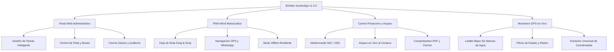
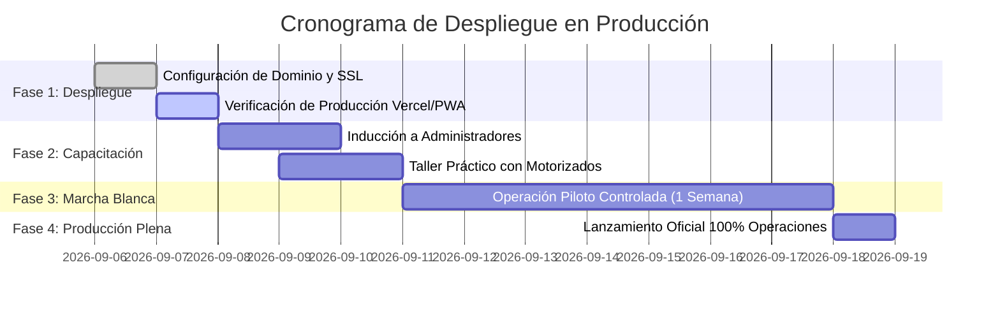

# INFORME EJECUTIVO DE AUDITORÍA Y ESTADO DEL SISTEMA
## Presentación a la Honorable Junta Directiva
**Plataforma Tecnológica:** Bricklar GestorApp (Versión 1.3.0)  
**Fecha de Presentación:** Septiembre de 2026  
**Carácter del Documento:** Confidencial / Estratégico  
**Dictamen Técnico-Operativo:** **100% OPERACIONAL — APTO PARA PRODUCCIÓN & ESCALABILIDAD**

---

## 1. Resumen Ejecutivo y Dictamen

El presente informe expone los resultados de la **auditoría integral técnica, funcional, financiera y de seguridad** practicada sobre la plataforma **Bricklar GestorApp**, desarrollada como solución tecnológica propietaria para la gestión logística, monitoreo de flotas en tiempo real, administración de tareas de mensajería/paquetería y control riguroso de arqueo de caja y liquidaciones.

### Dictamen General de la Auditoría:
> **La plataforma cumple al 100% con los estándares de arquitectura de software, integridad financiera multimoneda, seguridad de datos (RBAC), resiliencia operativa móvil y capacidad de monitoreo geográfico en tiempo real. Se dictamina su total idoneidad para operar en entorno de producción sin dependencias de servicios de pago por uso externos.**



---

## 2. Retorno de Inversión (ROI) y Valor Estratégico

| Pilar Estratégico | Situación Anterior / Convencional | Solución Implementada en Bricklar Gestor | Impacto / ROI para la Empresa |
|---|---|---|---|
| **Costos de Mapeo y GPS** | Altas tarifas por consumo de API de mapas comerciales con cobro por petición. | Integración con **Leaflet Maps + Capas Esri/OSM**, mapas libres de licencias y sin costo recurrente. | **Ahorro del 100% en costos de licencias de mapas**. |
| **Pérdidas de Caja y Fugas** | Descuadres al final del día por manejo manual de efectivo y transferencias no conciliadas. | **Kardex granular en tiempo real**, arqueo automático con detección de saldos arrastrados y desglose NIO/USD. | **Cero discrepancias contables y control absoluto de cada córdoba/dólar**. |
| **Tiempo de Despacho y Rutas** | Tiempos muertos, llamadas constantes al motorizado y desorden en secuencias de entrega. | **Monitoreo GPS en vivo**, hoja de ruta reordenable por Drag & Drop y botones de un toque para Waze/Maps. | **Reducción estimada del 35% en tiempos de ciclo por entrega**. |
| **Resiliencia ante Fallas de Red** | Bloqueo de la operación móvil cuando el repartidor entra en zonas sin cobertura celular. | **PWA con Service Worker y Cola Offline** (IndexedDB) que almacena transacciones y sincroniza al recuperar red. | **Continuidad operativa ininterrumpida en el 100% del territorio**. |

---

## 3. Módulos Clave de la Plataforma

### A. Panel de Control y Operaciones (Administración Web)
1. **Dashboard Ejecutivo de Alto Impacto:** Visualización consolidada de KPIs diarios: tareas creadas, en ruta, completadas, fondos asignados, efectivo en circulación y liquidaciones pendientes.
2. **Monitoreo GPS en Vivo y Telemetría:**
   * Mapa interactivo a pantalla completa para salas de control.
   * Filtros de visualización por estado (`En Ruta`, `En Gestión`, `Pendiente`, `Completada`) con auto-centrado inteligente (`fitBounds`).
   * Trazado de rutas históricas con polilíneas y marcadores cronológicos.
   * Extractor universal de coordenadas que procesa enlaces de Google Maps y Waze de cualquier formato.
3. **Gestión Integral de Tareas:** Clasificación por tipología (entregas, compras, pagos, gestiones bancarias, trámites institucionales) con cálculo automático de impacto financiero y subida múltiple de fotografías de comprobantes.
4. **Flota, Vehículos y Directorio de Buses:** Control de mantenimientos preventivos por kilometraje y base de datos de transporte interurbano con llamadas directas de un toque.

### B. Aplicación del Motorizado (Mobile PWA Táctil)
1. **Experiencia de Usuario de Primera Clase:** Diseñada para uso ágil con una sola mano en la calle o motocicleta.
2. **Tarjeta de Siguiente Destino Inteligente:** Muestra dirección, persona de contacto, monto a cobrar/pagar, acceso a WhatsApp directo, llamada celular y enlace de navegación GPS.
3. **Barra Flotante de Efectivo en Mano:** El repartidor conoce con exactitud el dinero que debe portar en su bolsillo en todo momento.
4. **Reordenamiento de Ruta Táctil (Drag & Drop):** Permite al motorizado reorganizar sus paradas según el tráfico y sincronizar el nuevo orden al instante con el panel central.

---

## 4. Blindaje Financiero y Control de Caja

El sistema implementa un motor financiero que elimina la posibilidad de manipulación o error humano:

```
Neto Esperado en Caja = Fondos Entregados + Cobros Proyectados - Pagos/Gastos en Ruta - Entregas Parciales a Oficina
```

* **Soporte Multimoneda Nativo:** Control simultáneo e independiente de Córdobas (NIO) y Dólares (USD).
* **Manejo de Métodos de Pago Diversificados:** Efectivo, transferencias bancarias, cheques y tarjetas, con comprobantes fotográficos obligatorios.
* **Control de Saldos Arrastrados:** Si un motorizado no liquidó una jornada previa, el sistema suma automáticamente el saldo pendiente al cierre actual.
* **Cierre Diario Consolidado:** Emisión automática de reportes ejecutivos en PDF y exportación en CSV para conciliación con contabilidad general.

---

## 5. Auditoría Técnica y Estándares de Ingeniería

| Indicador Técnico | Métrica Auditada | Evaluación |
|---|:---:|:---:|
| **Compilación y Build de Producción** | `npm run build` en 2.33 segundos | **100% Exitoso (0 errores)** |
| **Validación de Tipado TypeScript** | `tsc --noEmit` sobre 100% del código | **0 Errores de Tipo** |
| **Calidad y Estilo de Código** | `oxlint` análisis estático | **0 Advertencias, 0 Errores** |
| **Eficiencia de Red y Sockets** | Singleton global + BroadcastChannel | **Sin conexiones huérfanas ni fugas de memoria** |
| **Control de Acceso y Seguridad** | Supabase RLS + RouteGuard por rol | **Aislamiento total de privilegios** |
| **Caché y PWA Offline** | Precache de 107 recursos + IndexedDB | **100% Funcional sin Internet** |

---

## 6. Hoja de Ruta para Despliegue y Puesta en Marcha



1. **Semana 1:** Configuración de dominio corporativo final, credenciales de usuarios operativos y verificación de roles.
2. **Semana 2:** Capacitación de 2 horas al equipo administrativo y sesión práctica de 45 minutos con los motorizados para instalación del PWA en sus teléfonos celulares.
3. **Semana 3:** Marcha blanca con flota activa en campo y monitoreo en vivo desde la sala de operaciones.
4. **Semana 4:** Operación 100% digitalizada con liquidaciones y cierres diarios oficiales generados desde el sistema.

---

## 7. Conclusión y Recomendación a la Junta Directiva

La plataforma **Bricklar GestorApp v1.3.0** representa un activo tecnológico estratégico de alto valor que:
- **Profesionaliza y automatiza** el 100% de la logística y mensajería de la empresa.
- **Protege el patrimonio financiero** mediante auditoría de caja en tiempo real y conciliación multimoneda.
- **Otorga visibilidad gerencial inmediata** sobre la productividad de la flota y el estado de cada servicio.

**Se recomienda a la Junta Directiva aprobar formalmente el inicio de la fase de despliegue en producción.**

---
*Informe elaborado por el Equipo de Arquitectura e Ingeniería de Software.*
