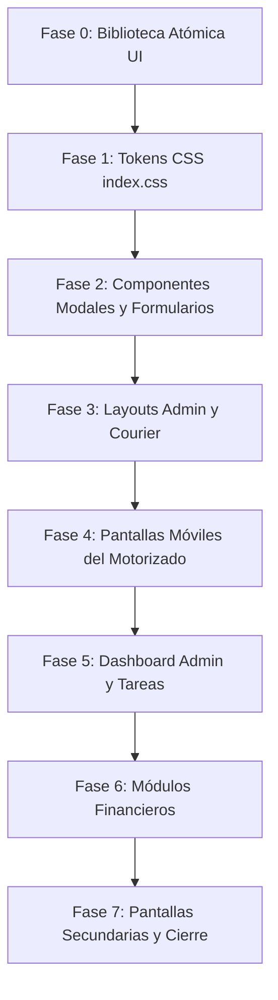

# MASTER IMPLEMENTATION PLAN V1
## Documento Maestro Oficial del Proyecto Bricklar Gestor

> **Proyecto:** Bricklar Gestor  
> **Fecha de Emisión:** 1 de Agosto de 2026  
> **Autor:** Arquitectura de Software & Tech Lead Frontend  
> **Versión:** 1.0.0 (Oficial y Consolidado)  
> **Estado:** Documento Maestro Final — **Guía Obligatoria de Desarrollo**

---

## 1. RESUMEN EJECUTIVO

### 1.1 Estado General del Proyecto
**Bricklar Gestor** es una plataforma web y PWA interna para la administración de operaciones logísticas, gestión de entregas, motorizados, directorio de buses interurbanos y control financiero multimoneda (C$ y US$) en Nicaragua.

El proyecto se encuentra en un estado **estable, funcional y de alta calidad técnica**. El backend está desplegado en **Supabase (PostgreSQL + RLS + Edge Functions)** y el cliente en **React 18.3 + Vite 8.2 + TypeScript 6.0**.

### 1.2 Estado Técnico y de Compilación
* **Compilación TypeScript (`npx tsc --noEmit`):** Exit Code 0 (**0 Errores**).
* **Linter (`npm run lint` - Oxlint):** Exit Code 0 (**0 Errores, 0 Advertencias**).
* **Build de Producción (`npm run build`):** Exit Code 0 (**Compilación en 2.17s generando `dist/`**).
* **Git Status:** 0 archivos rotos, cero secretos expuestos.

### 1.3 Estado Visual y Design System
Actualmente la aplicación se encuentra en un estado de **transición parcial de interfaz**. Las pantallas principales (Login, Layouts, Dashboards) ya fueron adaptadas a la nueva identidad. El Design System Bricklar V1 elimina por completo el magenta como color principal y establece como paleta oficial el **Azul Marino (`#26326B` / `#181D43`)** como primario y **Celeste (`#0284C7`)** como secundario.

```
┌────────────────────────────────────────────────────────────────────────┐
│                    ESTADO TÉCNICO GENERAL DEL PROYECTO                 │
├───────────────────┬───────────────────┬────────────────────────────────┤
│ BUILD VITE: 2.17s │  TYPESCRIPT: OK   │        LINTER: 0 ERRORS        │
│ 2859 Módulos OK   │  0 Errores        │        0 Advertencias          │
└───────────────────┴───────────────────┴────────────────────────────────┘
```

---

## 2. VISIÓN OFICIAL DEL PRODUCTO

### 2.1 Filosofía del Producto
Bricklar Gestor se rige por la **simplicidad absoluta, velocidad de ejecución y cero ruido visual**. El producto está diseñado para usarse durante muchas horas sin fatiga visual en escritorios de administración y a una sola mano en dispositivos móviles de motorizados.

### 2.2 Lo que REPRESENTA Bricklar Gestor
* **Velocidad:** Transiciones de estado de tarea y cobro registrables en menos de 3 segundos.
* **Control Financiero:** Claridad absoluta en el saldo en mano en Córdobas (C$) y Dólares (US$).
* **Ergonomía Móvil:** Botones táctiles de 48px+ situados en la zona inferior de la pantalla para el motorizado.
* **Consistencia Visual:** Tarjetas blancas (`#FFFFFF`) sobre lienzos gris ultra claro (`#F8FAFC`).

### 2.3 Lo que NUNCA debe convertirse Bricklar Gestor
* ❌ **NO** debe convertirse en un panel administrativo genérico sobrecargado de gráficos decorativos inservibles.
* ❌ **NO** debe incluir menús anidados profundos ni configuraciones complejas que requieran capacitación previa.
* ❌ **NO** debe utilizar colores estridentes o decorativos que confundan los estados operacionales.

---

## 3. ARQUITECTURA OFICIAL

```
GESTOR DE TAREAS/
├── src/
│   ├── app/                  # Proveedores globales (providers.tsx) y Router (router.tsx)
│   ├── layouts/              # AdminLayout.tsx, CourierLayout.tsx, AuthLayout.tsx
│   ├── pages/                # Vistas de Admin (13), Courier (8) y Auth (4)
│   ├── modules/              # Dominios: auth, tasks, users, workdays, settlements, branches, buses
│   └── shared/               # lib (supabase, query), types, utils (cn.ts), validations (schemas.ts)
└── supabase/
    └── functions/            # Edge Functions: create-user, delete-user
```

### 3.1 Decisiones de Arquitectura Frontend y Backend
* **Frontend UI Framework:** React 18.3 + TypeScript 6.0 + Vite 8.2.
* **Capa de Estilos:** Tailwind CSS v4 con variables configuradas en el bloque `@theme` de `src/index.css`.
* **Manejo de Estado y Caché:** TanStack Query v5 (React Query) sin estado global complejo en Redux.
* **Autenticación:** Supabase Auth + `AuthContext.tsx` + `useAuth.ts` + Guardias por rol (`general_admin`, `junior_admin`, `courier`).
* **Seguridad de Datos:** Base de Datos PostgreSQL con Row Level Security (RLS) basado en sucursales.
* **Funciones de BD (RPC):** `generate_task_code` (código consecutivo), `compute_settlement` (liquidaciones), `log_audit_event`.

---

## 4. DESIGN SYSTEM OFICIAL (BRICKLAR V1)

### 4.1 Paleta de Colores Corporativa

```css
@theme {
  /* Identidad Oficial */
  --color-primary: #26326B;       /* Azul Marino Oficial */
  --color-primary-dark: #181D43;  /* Azul Noche (Sidebar/Headers) */
  --color-secondary: #0284C7;     /* Celeste (Interacción/Enlaces/Focos) */
  --color-secondary-hover: #0369A1;

  /* Superficies */
  --color-background: #F8FAFC;    /* Gris Ultra Claro (Canvas) */
  --color-surface: #FFFFFF;       /* Blanco Puro (Tarjetas/Modales) */
  --color-border: #E2E8F0;        /* Gris Suave (Bordes) */

  /* Semántica Estricta */
  --color-success: #16A34A;       /* Verde - Únicamente Éxito/Completado */
  --color-success-subtle: #DCFCE7;
  --color-warning: #D97706;       /* Naranja - Únicamente Advertencia/Pendiente */
  --color-warning-subtle: #FEF3C7;
  --color-destructive: #DC2626;   /* Rojo - Únicamente Error/Cancelado/Borrado */
  --color-destructive-subtle: #FEE2E2;

  /* Geometría y Elevación */
  --radius-lg: 0.75rem;           /* 12px - Botones e Inputs */
  --radius-xl: 1rem;              /* 16px - Tarjetas y Modales */
  --shadow-card: 0 1px 3px 0 rgb(15 23 42 / 0.04);
}
```

### 4.2 Naming Convention Oficial de Componentes
* **Botones:** `.btn-saas-primary`, `.btn-saas-secondary`, `.btn-saas-outline`, `.btn-touch-hero`.
* **Tarjetas:** `.card-saas`, `.bento-card`, `.hero-card-courier`, `.metric-card`.
* **Tablas:** `.table-saas`.
* **Badges:** `.badge-saas`, `.badge-pending`, `.badge-completed`, `.badge-en-route`, `.badge-urgent`.
* **Inputs:** `.input-saas`, `.select-saas`, `.textarea-saas`.
* **Componentes Móviles:** `.cash-summary-bar`, `.bottom-nav-saas`.

---

## 5. REGLAS ARQUITECTÓNICAS (MANDATORIAS)

### 5.1 Lo que está PERMITIDO
* ✔️ Reutilizar componentes atómicos en `src/shared/components/ui/`.
* ✔️ Utilizar las clases compuestas oficializadas en `src/index.css`.
* ✔️ Mantener la arquitectura por dominios de `src/modules/`.
* ✔️ Usar `Intl.NumberFormat('es-NI')` con tipografía monoespaciada para importes C$ y US$.

### 5.2 Lo que está PROHIBIDO
* ❌ **PROHIBIDO** incluir colores magenta (`#B90E7C`) como acentos principales.
* ❌ **PROHIBIDO** realizar llamadas directas a Supabase desde componentes React (deben usar `services/`).
* ❌ **PROHIBIDO** utilizar colores intensos en badges o fondos que no correspondan a su semántica estricta.
* ❌ **PROHIBIDO** incluir botones interactivos con altura menor a 44px/48px en vistas móviles.

---

## 6. ALCANCE DEL PROYECTO

### 6.1 Funcionalidades Incluidas en Versión Actual
1. Autenticación y recuperación de contraseña.
2. Control de acceso por roles (`general_admin`, `junior_admin`, `courier`).
3. Gestión de 9 tipos de tareas y generación atómica de códigos consecutivos.
4. Control de jornadas, entregas de fondos y devoluciones de caja.
5. Liquidaciones consolidadas multimoneda (NIO/USD) y cierre diario.
6. Directorio de buses interurbanos con marcado directo de llamadas.
7. Generador de reportes PDF y exportador CSV.
8. Registro inmutable de auditoría (`audit_logs`).

### 6.2 Funcionalidades Diferidas (Fase 2 / Futuro)
* Integración de mapas interactivos en vivo (OpenStreetMap / Mapbox).
* Impresión directa por Bluetooth en impresoras térmicas de 58mm.
* Sincronización offline con Service Worker PWA nativo.

---

## 7. ROADMAP OFICIAL DE IMPLEMENTACIÓN (8 FASES)



### Detalle de Fases de Migración

#### **Fase 0: Biblioteca Atómica UI (`src/shared/components/ui/`)**
* **Objetivo:** Crear los componentes base atómicos (`Button`, `Input`, `Badge`, `Card`, `Modal`, `Toast`, `Skeleton`).
* **Archivos:** `src/shared/components/ui/*`.
* **Tiempo Est.:** 45 min | **Riesgo:** Cero.
* **Criterio de Aceptación:** Exportación limpia con TypeScript estricto.

#### **Fase 1: Tokens y Variables CSS (`src/index.css`)**
* **Objetivo:** Actualizar el bloque `@theme` de Tailwind v4 asignando Azul Marino y Celeste.
* **Archivos:** `src/index.css`.
* **Tiempo Est.:** 15 min | **Riesgo:** Muy bajo.
* **Criterio de Aceptación:** Aplicación adopta automáticamente los nuevos colores globales.

#### **Fase 2: Estandarización de Componentes Base**
* **Objetivo:** Reemplazar clases inline repetidas de botones, tarjetas, inputs y badges en modales.
* **Archivos:** Componentes en `src/modules/*/components/`.
* **Tiempo Est.:** 45 min | **Riesgo:** Bajo.
* **Criterio de Aceptación:** Eliminación del 100% de clases hexadecimales inline.

#### **Fase 3: Layouts y Navegación**
* **Objetivo:** Rediseñar `AdminLayout.tsx` (Sidebar/Topbar) y `CourierLayout.tsx` (Header/Bottom Nav).
* **Archivos:** `src/layouts/AdminLayout.tsx`, `CourierLayout.tsx`.
* **Tiempo Est.:** 40 min | **Riesgo:** Bajo.
* **Criterio de Aceptación:** Navegación fluida y adaptativa probada en escritorio y móvil.

#### **Fase 4: Pantallas Móviles del Motorizado**
* **Objetivo:** Migrar las 8 pantallas móviles de motorizados (`/motorizado/*`).
* **Archivos:** `src/pages/courier/*`.
* **Tiempo Est.:** 1h 30 min | **Riesgo:** Bajo.
* **Criterio de Aceptación:** Operación táctil a una mano y barra de efectivo fija validadas.

#### **Fase 5: Dashboard Administrativo y Tareas**
* **Objetivo:** Migrar `DashboardPage.tsx`, `TasksPage.tsx`, `TaskDetailPage.tsx` y `UsersPage.tsx`.
* **Archivos:** `src/pages/admin/DashboardPage.tsx`, `TasksPage.tsx`, `TaskDetailPage.tsx`, `UsersPage.tsx`.
* **Tiempo Est.:** 1h 45 min | **Riesgo:** Bajo.
* **Criterio de Aceptación:** Bento Grids y tablas SaaS operativas.

#### **Fase 6: Módulos Financieros**
* **Objetivo:** Migrar `SettlementsPage.tsx`, `WorkdaysPage.tsx` y `DailyClosurePage.tsx`.
* **Archivos:** `src/pages/admin/SettlementsPage.tsx`, `WorkdaysPage.tsx`, `DailyClosurePage.tsx`.
* **Tiempo Est.:** 1h 00 min | **Riesgo:** Bajo.
* **Criterio de Aceptación:** Despliegue correcto de saldos C$ y US$.

#### **Fase 7: Pantallas Secundarias y Cierre**
* **Objetivo:** Migrar `BranchesPage.tsx`, `BusDirectoryPage.tsx`, `ReportsPage.tsx`, `AuditPage.tsx`, `SettingsPage.tsx` y `MaintenancePage.tsx`.
* **Archivos:** `src/pages/admin/*` restantes.
* **Tiempo Est.:** 1h 15 min | **Riesgo:** Muy bajo.
* **Criterio de Aceptación:** `npm run lint`, `npx tsc --noEmit` y `npm run build` con 0 errores.

---

## 8. DEFINITION OF DONE (DoD)

Ninguna fase podrá considerarse concluida si no cumple estrictamente con:

- [ ] **Build Exitoso:** `npm run build` genera la carpeta `dist/` en exit code 0.
- [ ] **TypeScript Limpio:** `npx tsc --noEmit` pasa con 0 errores.
- [ ] **Linter Limpio:** `npm run lint` pasa con 0 errores y 0 advertencias.
- [ ] **Responsive Validado:** Verificado en Desktop (1920x1080), Tablet (768x1024) y Mobile (375x812).
- [ ] **Accesibilidad Validada:** Foco visible en `#0284C7` y targets táctiles móviles ≥ 44px/48px.
- [ ] **Estados UI Cubiertos:** Estados de carga (Skeleton/Shimmer), vacío (EmptyState) y error (AlertBanner) implementados.
- [ ] **Cero Regresiones Funcionales:** Flujos de autenticación, asignación de tareas y cobros 100% operativos.
- [ ] **Cero Secretos expuestos:** Ningún archivo `.env` o clave secreta rastreada en Git.

---

## 9. CHECKLIST MAESTRO DE CONTROL

```
[ ] FASE 0: Biblioteca Atómica UI
    [ ] Crear src/shared/components/ui/Button.tsx
    [ ] Crear src/shared/components/ui/Input.tsx
    [ ] Crear src/shared/components/ui/Badge.tsx
    [ ] Crear src/shared/components/ui/Card.tsx
    [ ] Crear src/shared/components/ui/Modal.tsx

[ ] FASE 1: Tokens y Variables CSS
    [ ] Actualizar @theme en src/index.css con Azul Marino y Celeste
    [ ] Eliminar variables residuales de magenta
    [ ] Validar compilación global con npm run build

[ ] FASE 2: Estandarización de Componentes Base
    [ ] Migrar modales de tareas (TaskFormModal, TaskStatusModal)
    [ ] Migrar modales de usuarios (UserFormModal, DeleteUserConfirmModal)
    [ ] Migrar modales del motorizado (StartWorkdayModal, CompleteTaskModal)

[ ] FASE 3: Layouts y Navegación
    [ ] Refactorizar AdminLayout.tsx
    [ ] Refactorizar CourierLayout.tsx

[ ] FASE 4: Pantallas del Motorizado
    [ ] Migrar CourierHomePage.tsx
    [ ] Migrar CourierTasksPage.tsx
    [ ] Migrar CourierTaskDetailPage.tsx
    [ ] Migrar CourierRoutePage.tsx
    [ ] Migrar CourierFundsPage.tsx y SettlementPage.tsx

[ ] FASE 5: Dashboard Admin y Tareas
    [ ] Migrar AdminDashboardPage.tsx
    [ ] Migrar AdminTasksPage.tsx
    [ ] Migrar AdminTaskDetailPage.tsx
    [ ] Migrar AdminUsersPage.tsx

[ ] FASE 6: Módulos Financieros
    [ ] Migrar AdminSettlementsPage.tsx
    [ ] Migrar AdminWorkdaysPage.tsx
    [ ] Migrar AdminDailyClosurePage.tsx

[ ] FASE 7: Pantallas Secundarias y Validación Final
    [ ] Migrar BranchesPage, BusDirectoryPage, ReportsPage, AuditPage, SettingsPage, MaintenancePage
    [ ] Ejecutar chequeo final: npx tsc --noEmit (0 errores)
    [ ] Ejecutar linter final: npm run lint (0 errores, 0 advertencias)
    [ ] Ejecutar build final: npm run build (Exit code 0)
```

---

## 10. REGISTRO DE PROGRESO DE EJECUCIÓN

| Fase | Fecha Inicio | Fecha Fin | Estado | Responsable | Observaciones |
| :--- | :---: | :---: | :---: | :--- | :--- |
| **Fase 0** | *Pendiente* | *Pendiente* | Por iniciar | Tech Lead | Creación de componentes UI base |
| **Fase 1** | *Pendiente* | *Pendiente* | Por iniciar | Tech Lead | Tokens de colores en index.css |
| **Fase 2** | *Pendiente* | *Pendiente* | Por iniciar | Tech Lead | Modales y formularios base |
| **Fase 3** | *Pendiente* | *Pendiente* | Por iniciar | Tech Lead | Layouts de Admin y Courier |
| **Fase 4** | *Pendiente* | *Pendiente* | Por iniciar | Tech Lead | Pantallas móviles de motorizado |
| **Fase 5** | *Pendiente* | *Pendiente* | Por iniciar | Tech Lead | Dashboard Admin y Tareas |
| **Fase 6** | *Pendiente* | *Pendiente* | Por iniciar | Tech Lead | Módulos Financieros |
| **Fase 7** | *Pendiente* | *Pendiente* | Por iniciar | Tech Lead | Cierre final y verificación |

---

## 11. REGISTRO OFICIAL DE CAMBIOS Y MANTENIMIENTO DE HISTORIAL

Al finalizar cada Fase del Roadmap, se deberá actualizar únicamente:
1. La tabla del **Sección 10 (Registro de Progreso)** de este documento.
2. El archivo **`CHANGELOG.md`**, agregando el bloque correspondiente a la fase concluida.
3. El archivo **`PROJECT_STATUS.md`**, actualizando el porcentaje de avance general.

---

## 12. MATRIZ CONSOLIDADA DE RIESGOS

| Riesgo | Nivel | Mitigación Técnica |
| :--- | :---: | :--- |
| **Conflicto de Colores en Clases Legacy** | Bajo | La redefinición de `@theme` en `index.css` propagará automáticamente los nuevos colores a todas las clases Tailwind. |
| **Corte de Modales en Pantallas Pequeñas** | Medio | Utilizar contenedores con `max-h-[90vh]` y `overflow-y-auto` en móviles. |
| **Regresión en Cálculo de C$/US$** | Alto | Mantener intactos los servicios `settlementsService.ts` y las llamadas a RPC PostgreSQL `compute_settlement`. |

---

## 13. ESTRATEGIA DE VALIDACIÓN

Antes de dar por aprobada cada fase, se ejecutará en orden estricto:
1. `git diff --check` (Verificación de formato de texto).
2. `npm run lint` (Debe devolver `Found 0 warnings and 0 errors`).
3. `npx tsc --noEmit` (Debe devolver exit code 0).
4. `npm run build` (Debe generar el bundle en `dist/` en exit code 0).

---

## 14. ESTRATEGIA DE ROLLBACK

Si durante la ejecución de una fase se detecta un fallo imprevisto o regresión que no pueda corregirse inmediatamente:
1. Se ejecutará `git restore <archivos-afectados>` para revertir los cambios de la fase activa al estado limpio previo.
2. Se verificará la estabilidad del sistema ejecutando `npm run build` y `npm run lint`.
3. Se revisará la causa raíz antes de reintentar la fase.

---

## 15. CONCLUSIÓN Y DICTAMEN TÉCNICO FINAL

### ¿Está Bricklar Gestor listo para comenzar la implementación del nuevo Design System?

# SÍ

### Justificación Técnica Final:
El proyecto cuenta con un entorno de desarrollo impecable (**0 errores de TypeScript**, **0 errores de Linter**, **build exitoso en 2.17s**), una arquitectura de datos totalmente desacoplada de la interfaz gráfica y un plan maestro de migración en 8 fases de riesgo controlado.

---

> ✋ **DECLARACIÓN FINAL DE CONTROL:**  
> Se ha creado el documento maestro oficial [`MASTER_IMPLEMENTATION_PLAN_V1.md`](file:///c:/Users/MSI%20Gamer/Documents/ANTIGRAVITY/GESTOR%20DE%20TAREAS/MASTER_IMPLEMENTATION_PLAN_V1.md). **No se ha modificado ningún archivo de código del proyecto.** Me detengo en este punto y quedo a la espera de tu autorización explícita para dar inicio a la Fase 0 / Fase 1 del desarrollo.
