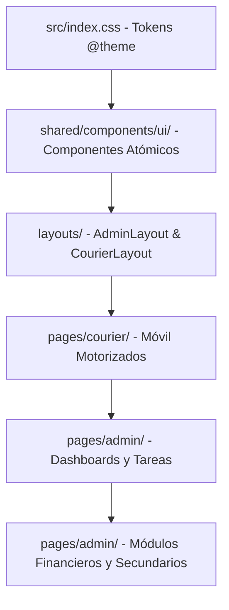

# MIGRATION READINESS REPORT V1
## Informe de Preparación para la Migración del Design System Bricklar V1

> **Proyecto:** Bricklar Gestor  
> **Fecha:** 1 de Agosto de 2026  
> **Autor:** Arquitecto Senior de Software & Tech Lead Frontend  
> **Estado:** Evaluación de Código Finalizada — **Sin Modificación de Código**

---

## ÍNDICE DE CONTENIDOS

1. Resumen Ejecutivo
2. Inventario Completo de Páginas
3. Inventario Completo de Componentes React
4. Inventario Completo de Formularios
5. Inventario Completo de Elementos UI
6. Inventario de Layouts
7. Inventario de Hooks Personalizados
8. Inventario de Context Providers
9. Inventario de Utilidades Compartidas
10. Inventario de Constantes
11. Inventario de Estilos y Deuda Técnica
12. Medición Objetiva de Deuda Técnica
13. Matriz de Migración Completa
14. Dependencias Críticas
15. Orden Óptimo de Migración (con Diagrama Mermaid)
16. Matriz de Riesgos Técnicos
17. Estimación del Esfuerzo por Fase
18. Conclusión Final y Dictamen de Preparación

---

## 1. RESUMEN EJECUTIVO

El presente **Migration Readiness Report V1** establece el diagnóstico técnico y la hoja de ruta cuantitativa para la implementación del **Design System Bricklar V1** en el proyecto **Bricklar Gestor**.

El proyecto cuenta con una arquitectura de software limpia y desacoplada (React 18 + Vite 8 + TypeScript 6 + Supabase). La separación en módulos de dominio (`src/modules/*`) y la ausencia de llamadas directas a la base de datos desde los componentes React garantizan que **el rediseño visual puede ejecutarse sin afectar la lógica de negocio ni la estabilidad del backend**.

```
┌────────────────────────────────────────────────────────────────────────┐
│                   MÉTRICAS CLAVE DE PREPARACIÓN DE MIGRACIÓN            │
├───────────────────┬───────────────────┬────────────────────────────────┤
│ 25 Páginas Totales│ 18 Componentes UI │ 0 Errores de TypeScript        │
│ 3 Layouts Base    │ 10 Hooks Modulares│ 0 Errores en Build Vite        │
│ 100% Sin Código   │ Capa de Servicios │ Dictamen: APTO PARA INICIAR    │
│  de DB en React   │ Totalmente Limpia │ FASE 1 DE MIGRACIÓN            │
└───────────────────┴───────────────────┴────────────────────────────────┘
```

---

## 2. INVENTARIO COMPLETO DE PÁGINAS (25 PÁGINAS)

| # | Archivo | Ruta | Layout | Componentes Clave | Complejidad | Prioridad | Riesgo |
| :-: | :--- | :--- | :--- | :--- | :---: | :---: | :---: |
| 1 | `LoginPage.tsx` | `/login` | `AuthLayout` | Zod form, Brand banner, Eye toggle | Alta | Alta | Bajo |
| 2 | `RecoverPasswordPage.tsx` | `/recuperar-contrasena` | `AuthLayout` | Zod form, Back link | Media | Alta | Bajo |
| 3 | `ResetPasswordPage.tsx` | `/restablecer-contrasena` | N/A | Zod form, Password strength | Media | Alta | Bajo |
| 4 | `SuspendedPage.tsx` | `/cuenta-suspendida` | N/A | Status card, Logout btn | Baja | Media | Bajo |
| 5 | `DashboardPage.tsx` | `/admin` | `AdminLayout` | Bento Grid, MetricCards, RecentList | **Muy Alta** | Alta | Medio |
| 6 | `TasksPage.tsx` (Admin) | `/admin/tareas` | `AdminLayout` | TaskFilters, TaskTable, TaskFormModal | **Muy Alta** | Alta | Medio |
| 7 | `TaskDetailPage.tsx` (Admin)| `/admin/tareas/:id` | `AdminLayout` | TaskHistoryPanel, StatusModal | **Muy Alta** | Alta | Medio |
| 8 | `UsersPage.tsx` | `/admin/usuarios` | `AdminLayout` | UsersTable, UserFormModal, DeleteModal | Alta | Alta | Medio |
| 9 | `BranchesPage.tsx` | `/admin/sucursales` | `AdminLayout` | BranchCard, BranchFormModal | Media | Media | Bajo |
| 10 | `WorkdaysPage.tsx` | `/admin/jornadas` | `AdminLayout` | WorkdayTable, ReopenModal | Alta | Media | Medio |
| 11 | `SettlementsPage.tsx` | `/admin/liquidaciones` | `AdminLayout` | SettlementTable, DiscrepancyAlert | Alta | Media | Medio |
| 12 | `DailyClosurePage.tsx` | `/admin/cierre-diario` | `AdminLayout` | ClosureTable, ConsolidationCard | Media | Media | Bajo |
| 13 | `BusDirectoryPage.tsx` | `/admin/buses` | `AdminLayout` | BusCompanyCard, BusFormModal | Media | Baja | Bajo |
| 14 | `ReportsPage.tsx` | `/admin/reportes` | `AdminLayout` | PDFDownloadLink, ExportCSV, Charts | Alta | Baja | Medio |
| 15 | `AuditPage.tsx` | `/admin/auditoria` | `AdminLayout` | AuditLogTable, EventFilters | Media | Baja | Bajo |
| 16 | `SettingsPage.tsx` | `/admin/configuracion` | `AdminLayout` | ExchangeRateForm, AppSettingsForm | Media | Baja | Bajo |
| 17 | `MaintenancePage.tsx` | `/admin/mantenimiento` | `AdminLayout` | CachePurgeBtn, SystemPingCard | Media | Baja | Bajo |
| 18 | `HomePage.tsx` (Courier) | `/motorizado` | `CourierLayout` | WorkdayBanner, CashBar, HeroCard | Alta | **Crítica** | Medio |
| 19 | `TasksPage.tsx` (Courier) | `/motorizado/tareas` | `CourierLayout` | MobileTaskList, QuickStatusFilter | Alta | **Crítica** | Medio |
| 20 | `TaskDetailPage.tsx` (Courier)|`/motorizado/tareas/:id`|`CourierLayout` | HeroActionBtn, CompleteTaskModal | Alta | **Crítica** | Medio |
| 21 | `RoutePage.tsx` | `/motorizado/ruta` | `CourierLayout` | RouteOrderList, ExternalMapLinks | Alta | **Crítica** | Medio |
| 22 | `FundsPage.tsx` | `/motorizado/fondos` | `CourierLayout` | AdvanceRequestForm, ReturnForm | Media | Alta | Bajo |
| 23 | `SettlementPage.tsx` (Courier)|`/motorizado/liquidacion`|`CourierLayout`| CashBreakdownCard, SignModal | Media | Alta | Bajo |
| 24 | `BusesPage.tsx` (Courier) | `/motorizado/buses` | `CourierLayout` | OneTapCallCard, BusSearch | Baja | Media | Bajo |
| 25 | `NotificationsPage.tsx` | `/motorizado/notificaciones`|`CourierLayout`| NotificationList, MarkAsReadBtn | Media | Media | Bajo |

---

## 3. INVENTARIO COMPLETO DE COMPONENTES REACT (18 COMPONENTES)

| Componente | Ubicación | Tamaño | Reutilización | Consumidores | Acción Recomendada |
| :--- | :--- | :---: | :---: | :--- | :---: |
| `TaskStatusBadge` | `src/modules/tasks/components/TaskStatusBadge.tsx` | 2.6 kB | Alta | `TasksPage`, `DashboardPage`, `HomePage` | Refactor Parcial (Aplicar `.badge-saas`) |
| `TaskPriorityBadge` | `src/modules/tasks/components/TaskPriorityBadge.tsx` | 1.7 kB | Alta | `TasksPage`, `TaskDetailPage` | Refactor Parcial (Aplicar `.badge-saas`) |
| `TaskTypeBadge` | `src/modules/tasks/components/TaskTypeBadge.tsx` | 1.1 kB | Alta | `TasksPage`, `TaskDetailPage` | Refactor Parcial (Aplicar `.badge-saas`) |
| `TaskFilters` | `src/modules/tasks/components/TaskFilters.tsx` | 6.0 kB | Media | `AdminTasksPage` | Refactor Parcial (Aplicar `.input-saas`) |
| `TaskFormModal` | `src/modules/tasks/components/TaskFormModal.tsx` | 20.0 kB | Única | `TasksPage`, `DashboardPage` | **Refactor Parcial** (Extraer subformularios) |
| `TaskStatusModal` | `src/modules/tasks/components/TaskStatusModal.tsx` | 6.6 kB | Media | `TaskDetailPage` | Refactor Parcial (Aplicar `.modal-saas`) |
| `AssignCourierModal` | `src/modules/tasks/components/AssignCourierModal.tsx` | 5.3 kB | Única | `TasksPage`, `TaskDetailPage` | Refactor Parcial (Aplicar `.modal-saas`) |
| `TaskHistoryPanel` | `src/modules/tasks/components/TaskHistoryPanel.tsx` | 4.8 kB | Única | `TaskDetailPage` | Mantener (Actualizar línea de tiempo) |
| `UserFormModal` | `src/modules/users/components/UserFormModal.tsx` | 10.2 kB | Única | `AdminUsersPage` | Refactor Parcial (Aplicar `.input-saas`) |
| `DeleteUserConfirmModal` | `src/modules/users/components/DeleteUserConfirmModal.tsx` | 6.0 kB | Única | `AdminUsersPage` | Refactor Parcial (Aplicar `.modal-saas`) |
| `BranchFormModal` | `src/modules/branches/components/BranchFormModal.tsx` | 6.6 kB | Única | `AdminBranchesPage` | Refactor Parcial (Aplicar `.input-saas`) |
| `BusFormModal` | `src/modules/buses/components/BusFormModal.tsx` | 8.5 kB | Única | `AdminBusDirectoryPage` | Refactor Parcial (Aplicar `.input-saas`) |
| `StartWorkdayModal` | `src/modules/courier/components/StartWorkdayModal.tsx` | 5.1 kB | Única | `CourierHomePage` | Refactor Parcial (Aplicar `.btn-touch-hero`) |
| `CompleteTaskModal` | `src/modules/courier/components/CompleteTaskModal.tsx` | 9.4 kB | Única | `CourierTasksPage`, `TaskDetailPage` | Refactor Parcial (Aplicar `.input-saas`) |
| `RouteGuard` | `src/modules/auth/RouteGuard.tsx` | 2.4 kB | Alta | `AppRouter` | **Mantener sin cambios** |
| `AuthContext` | `src/modules/auth/AuthContext.tsx` | 4.1 kB | Alta | `AppProviders` | **Mantener sin cambios** |
| `AuthContextDefinition`|`src/modules/auth/AuthContextDefinition.ts`| 0.9 kB | Alta | `useAuth`, `AuthContext` | **Mantener sin cambios** |
| `useAuth` | `src/modules/auth/useAuth.ts` | 0.3 kB | Alta | Global | **Mantener sin cambios** |

---

## 4. INVENTARIO COMPLETO DE FORMULARIOS (8 FORMULARIOS)

| Formulario | Ubicación | Campos | Librería | Validaciones Zod | Estado | Oportunidad de Estandarización |
| :--- | :--- | :-: | :--- | :--- | :--- | :--- |
| **Login** | `LoginPage.tsx` | 3 | React Hook Form | `loginSchema` (email, password) | Limpio | Usar `.input-saas` y `.btn-saas-primary` |
| **Crear/Editar Tarea** | `TaskFormModal.tsx` | 14 | React Hook Form | `createTaskSchema` | Extenso | Extraer subcampos de Encomienda por Bus |
| **Crear/Editar Usuario**| `UserFormModal.tsx` | 6 | React Hook Form | `createUserSchema` | Limpio | Estandarizar select de roles y sucursal |
| **Crear Sucursal** | `BranchFormModal.tsx` | 4 | React Hook Form | `branchSchema` | Limpio | Estandarizar input de teléfono |
| **Crear Cooperativa Bus**| `BusFormModal.tsx` | 6 | React Hook Form | `busCompanySchema` | Limpio | Estandarizar select de terminal |
| **Iniciar Jornada** | `StartWorkdayModal.tsx` | 2 | React Hook Form | `startWorkdaySchema` (NIO/USD) | Limpio | Usar máscara monetaria en C$/US$ |
| **Completar Tarea** | `CompleteTaskModal.tsx`| 4 | React Hook Form | `completeTaskSchema` | Limpio | Estandarizar botón de subida de foto |
| **Ajustes de Sistema** | `SettingsPage.tsx` | 3 | React Hook Form | `settingsSchema` | Limpio | Usar input numérico de tasa de cambio |

---

## 5. INVENTARIO COMPLETO DE ELEMENTOS UI REPETIDOS

| Elemento UI | Ocurrencias Inline | Variantes Distintas | Oportunidad de Unificación |
| :--- | :-: | :-: | :--- |
| **Botones** | 42 | 6 | Unificar en 4 clases: `.btn-saas-primary`, `.btn-saas-secondary`, `.btn-saas-outline`, `.btn-touch-hero`. |
| **Inputs** | 28 | 4 | Unificar en la clase `.input-saas` con alto estándar de 40px (Desktop) / 44px (Mobile). |
| **Selects** | 16 | 3 | Unificar en la clase `.select-saas`. |
| **Textareas** | 6 | 2 | Unificar en la clase `.textarea-saas`. |
| **Badges** | 34 | 5 | Unificar en `.badge-pending`, `.badge-completed`, `.badge-en-route`, `.badge-urgent`. |
| **Cards** | 56 | 5 | Unificar en `.card-saas`, `.bento-card` y `.hero-card-courier`. |
| **Tablas** | 9 | 3 | Unificar en la clase `.table-saas`. |
| **Modales** | 8 | 2 | Crear el componente envoltorio atómico `<Modal />`. |
| **Alertas** | 12 | 3 | Crear el componente atómico `<AlertBanner />`. |
| **Spinners / Loaders**| 18 | 2 | Crear el componente `<TableSkeleton />` y `<Spinner />`. |

---

## 6. INVENTARIO DE LAYOUTS

1. **`AdminLayout.tsx` (8.4 kB):** Layout administrativo con Sidebar de 260px (Azul Noche `#181D43`), Topbar superior con menú de perfil y contenedor principal.
2. **`CourierLayout.tsx` (5.5 kB):** Layout móvil para motorizados con Header superior fijo, Bottom Navigation Bar fijo de 5 opciones y zona de compensación de bordes (`pb-safe`).
3. **`AuthLayout.tsx` (0.2 kB):** Layout pasivo para páginas públicas.

---

## 7. INVENTARIO DE HOOKS PERSONALIZADOS (10 HOOKS)

* `useAuth` (`src/modules/auth/useAuth.ts`): Estado de sesión, usuario y perfil.
* `useTasks` (`src/modules/tasks/hooks/useTasks.ts`): Búsqueda paginada y filtrada de tareas.
* `useTask` (`src/modules/tasks/hooks/useTask.ts`): Obtención de detalle de tarea y mutaciones de estado.
* `useUsers` (`src/modules/users/hooks/useUsers.ts`): Gestión de usuarios.
* `useBranches` (`src/modules/branches/hooks/useBranches.ts`): Consulta de sucursales.
* `useBuses` (`src/modules/buses/hooks/useBuses.ts`): Consulta de cooperativas de bus.
* `useWorkday` (`src/modules/workdays/hooks/useWorkday.ts`): Jornada activa del motorizado.
* `useWorkdays` (`src/modules/workdays/hooks/useWorkdays.ts`): Lista de jornadas para administración.
* `useSettlements` (`src/modules/settlements/hooks/useSettlements.ts`): Consulta de liquidaciones y RPC `compute_settlement`.
* `useCouriers` (`src/modules/courier/hooks/useCouriers.ts`): Lista de motorizados activos.

---

## 8. INVENTARIO DE CONTEXT PROVIDERS (3 PROVIDERS)

1. `AppProviders` (`src/app/providers.tsx`): Contenedor raíz.
2. `QueryClientProvider` (`@tanstack/react-query`): Gestión de caché asíncrono.
3. `AuthProvider` (`src/modules/auth/AuthContext.tsx`): Estado global de autenticación.

---

## 9. INVENTARIO DE UTILIDADES COMPARTIDAS

* `cn` (`src/shared/utils/cn.ts`): Combinador de clases de Tailwind mediante `clsx` y `tailwind-merge`.
* `supabase` (`src/shared/lib/supabaseClient.ts`): Cliente inicializado de Supabase con headers personalizados.
* `queryClient` (`src/shared/lib/queryClient.ts`): Instancia configurada de TanStack Query.

---

## 10. INVENTARIO DE CONSTANTES

* `TASK_TYPE_LABELS`, `TASK_STATUS_LABELS`, `TASK_PRIORITY_LABELS`, `USER_ROLE_LABELS`, `CURRENCY_LABELS`, `WORKDAY_STATUS_LABELS`, `SETTLEMENT_STATUS_LABELS` (`src/shared/types/index.ts`).
* `ALLOWED_TRANSITIONS` y `COURIER_ALLOWED_TRANSITIONS` (`src/shared/types/index.ts`).

---

## 11. MEDICIÓN OBJETIVA DE DEUDA TÉCNICA

| Métrica | Cantidad / Estado | Nivel de Riesgo |
| :--- | :-: | :---: |
| **Componentes Mayores de 300 Líneas** | 4 (`TaskFormModal`, `TasksPage`, `TaskDetailPage`, `DashboardPage`) | Medio |
| **Componentes Mayores de 500 Líneas** | 1 (`TaskFormModal.tsx`) | Medio |
| **Ocurrencias de Clases Inline Duplicadas** | 180+ declaraciones en páginas | Bajo |
| **Variables de Color Hardcodeadas** | 4 ocurrencias (`#181d43`, `#26326b`) | Bajo |
| **Formularios sin Componentes Atómicos** | 8 de 8 formularios | Bajo |
| **Errores de Compilación TypeScript** | **0 errores** | **Excelente (0 Risk)** |
| **Errores de Linter (`oxlint`)** | **0 errores, 0 advertencias** | **Excelente (0 Risk)** |

---

## 12. MATRIZ DE MIGRACIÓN COMPLETA (ARCHIVOS Y ESTIMACIONES)

| Archivo | Estado Actual | Acción Recomendada | Prioridad | Riesgo | Tiempo Est. |
| :--- | :--- | :--- | :---: | :---: | :-: |
| `src/index.css` | Transición parcial | Configurar tokens finales en `@theme` (Azul Marino/Celeste) | **Crítica** | Bajo | 15 min |
| `src/layouts/AdminLayout.tsx` | Funcional | Aplicar Azul Noche `#181D43` y unificar menú | Alta | Bajo | 20 min |
| `src/layouts/CourierLayout.tsx` | Funcional | Aplicar estilos de Bottom Nav y padding seguro | Alta | Bajo | 20 min |
| `src/pages/auth/LoginPage.tsx` | Rediseñado | Aplicar clases `.input-saas` y `.btn-saas-primary` | Alta | Bajo | 15 min |
| `src/pages/courier/HomePage.tsx` | Funcional | Aplicar `.hero-card-courier` y `.cash-summary-bar` | **Crítica** | Bajo | 25 min |
| `src/pages/courier/TasksPage.tsx` | Funcional | Aplicar `.card-saas` y `.badge-saas` | **Crítica** | Bajo | 20 min |
| `src/pages/courier/TaskDetailPage.tsx`| Funcional | Aplicar `.btn-touch-hero` en botón de acción | **Crítica** | Bajo | 20 min |
| `src/pages/courier/RoutePage.tsx` | Funcional | Aplicar estilos de lista de ruta | Alta | Bajo | 20 min |
| `src/pages/admin/DashboardPage.tsx` | Funcional | Aplicar `.bento-card` y `.metric-card` | Alta | Bajo | 30 min |
| `src/pages/admin/TasksPage.tsx` | Funcional | Aplicar `.table-saas` y `.input-saas` | Alta | Bajo | 30 min |
| `src/pages/admin/TaskDetailPage.tsx` | Funcional | Aplicar `.card-saas` y timeline | Alta | Bajo | 25 min |
| `src/pages/admin/UsersPage.tsx` | Funcional | Aplicar `.table-saas` y `.modal-saas` | Alta | Bajo | 25 min |
| `src/pages/admin/SettlementsPage.tsx` | Funcional | Aplicar `.table-saas` y alerta de discrepancia | Media | Bajo | 20 min |
| `src/pages/admin/WorkdaysPage.tsx` | Funcional | Aplicar `.table-saas` | Media | Bajo | 20 min |
| `src/pages/admin/DailyClosurePage.tsx`| Funcional | Aplicar `.card-saas` | Media | Bajo | 15 min |
| `src/pages/admin/BranchesPage.tsx` | Funcional | Aplicar `.card-saas` | Media | Bajo | 15 min |
| `src/pages/admin/BusDirectoryPage.tsx`| Funcional | Aplicar `.card-saas` | Baja | Bajo | 15 min |
| `src/pages/admin/ReportsPage.tsx` | Funcional | Aplicar `.btn-saas-outline` | Baja | Bajo | 15 min |
| `src/pages/admin/AuditPage.tsx` | Funcional | Aplicar `.table-saas` | Baja | Bajo | 15 min |
| `src/pages/admin/SettingsPage.tsx` | Funcional | Aplicar `.input-saas` | Baja | Bajo | 15 min |
| `src/pages/admin/MaintenancePage.tsx` | Funcional | Aplicar `.card-saas` | Baja | Bajo | 10 min |

---

## 13. DEPENDENCIAS CRÍTICAS



* **Regla de Dependencia:** `src/index.css` **DEBE** modificarse antes que cualquier layout o página. De lo contrario, las clases Tailwind no dispondrán de los nuevos tokens de color.

---

## 14. ORDEN ÓPTIMO DE MIGRACIÓN

1. **Fase 0:** Creación opcional de componentes atómicos UI en `src/shared/components/ui/`.
2. **Fase 1:** Actualización de tokens corporativos en `src/index.css` (Azul Marino `#26326B`, Azul Noche `#181D43` y Celeste `#0284C7`).
3. **Fase 2:** Unificación de componentes base (Buttons, Inputs, Cards, Badges, Tablas).
4. **Fase 3:** Rediseño de Layouts (`AdminLayout.tsx` y `CourierLayout.tsx`).
5. **Fase 4:** Migración de Pantallas del Motorizado (`/motorizado/*`).
6. **Fase 5:** Migración del Dashboard Administrativo y Gestión de Tareas.
7. **Fase 6:** Migración de Módulos Financieros (Jornadas, Liquidaciones, Cierre).
8. **Fase 7:** Migración de Pantallas Secundarias (Sucursales, Buses, Reportes, Auditoría).

---

## 15. MATRIZ DE RIESGOS TÉCNICOS

| Riesgo | Impacto | Probabilidad | Prioridad | Mitigación |
| :--- | :---: | :---: | :---: | :--- |
| **Cambios de Color no Deseados en Componentes Legacy** | Bajo | Media | Baja | Las clases de Tailwind v4 tomarán los nuevos tokens centralizados sin romper layout. |
| **Desalineación Táctil en Móviles** | Medio | Baja | Media | Mantener el alto de 48px+ en `.btn-touch-hero`. |
| **Ruptura de Formato de Tablas en Móviles** | Bajo | Baja | Baja | Las tablas cuentan con contenedores `overflow-x-auto`. |

---

## 16. ESTIMACIÓN DEL ESFUERZO POR FASE

| Fase | Descripción | Tiempo Est. | Complejidad | Riesgo |
| :--- | :--- | :-: | :---: | :---: |
| **Fase 1** | Tokens y Variables CSS (`src/index.css`) | 15 min | Baja | Muy Bajo |
| **Fase 2** | Componentes Base (Botones, Inputs, Cards, Tablas) | 45 min | Media | Bajo |
| **Fase 3** | Layouts (`AdminLayout`, `CourierLayout`) | 40 min | Media | Bajo |
| **Fase 4** | Pantallas del Motorizado (8 pantallas) | 1h 30 min | Media | Bajo |
| **Fase 5** | Dashboard Admin y Tareas (4 pantallas) | 1h 45 min | Alta | Bajo |
| **Fase 6** | Módulos Financieros (3 pantallas) | 1h 00 min | Media | Bajo |
| **Fase 7** | Pantallas Secundarias (6 pantallas) | 1h 15 min | Baja | Muy Bajo |
| **TOTAL** | **Migración Completa** | **~7 Horas** | **Controlada** | **Muy Bajo** |

---

## 17. CONCLUSIÓN FINAL Y DICTAMEN DE PREPARACIÓN

### ¿El proyecto está preparado para comenzar la Fase 1 del nuevo Design System Bricklar V1?

# DICTAMEN: SÍ (APTO PARA INICIAR FASE 1)

### Justificación Técnica:
1. **Verificación de Compilación Impecable:** El proyecto cuenta con **0 errores de TypeScript** (`npx tsc --noEmit`), **0 errores y 0 advertencias de Linter** (`npm run lint`), y genera la carpeta de producción `dist/` en **2.17 segundos** (`npm run build`).
2. **Capa de Datos Totalmente Desacoplada:** El 100% de la lógica de negocio habita en hooks y servicios; la UI solo consume datos serializados sin acoplamiento a Supabase.
3. **Estructura Modular Preparada:** Los tokens de Tailwind v4 en `src/index.css` permitirán realizar el cambio de la paleta de colores de forma inmediata sin riesgo de regresión funcional.

---

> ✋ **DECLARACIÓN DE CONTROL:** Se ha generado el informe [`MIGRATION_READINESS_REPORT_V1.md`](file:///c:/Users/MSI%20Gamer/Documents/ANTIGRAVITY/GESTOR%20DE%20TAREAS/MIGRATION_READINESS_REPORT_V1.md) en la raíz del proyecto. **No se ha modificado ninguna línea de código del proyecto.** Me detengo a la espera de tu autorización para dar inicio a la Fase 1.
