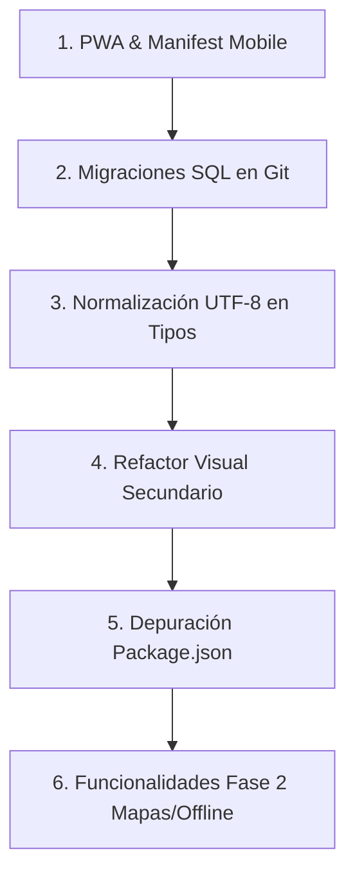

# Próximos Pasos Priorizados: Bricklar Gestor

> **Guía de Trabajo Priorizada para Desarrollo Futuro**

---

## 1. Tareas Críticas (Prioridad Alta)

- [ ] **Configuración PWA Completa (Service Worker + Manifest):**
  - Crear archivo `public/manifest.webmanifest` con iconos oficial de Bricklar (192x192, 512x512 PNG).
  - Configurar `vite-plugin-pwa` para asegurar almacenamiento en caché de la app shell y permitir instalación de icono en teléfonos móviles de motorizados.
- [ ] **Respaldo de Migraciones SQL Locales:**
  - Exportar la estructura DDL de PostgreSQL (tablas, RLS, índices) y las funciones RPC (`generate_task_code`, `compute_settlement`, `log_audit_event`) a la carpeta `supabase/migrations/` para mantener versionamiento en Git.
- [ ] **Conversión de Codificación de Archivos:**
  - Convertir el archivo `src/shared/lib/database.types.ts` de UTF-16LE a **UTF-8 sin BOM** para evitar incompatibilidades con herramientas de análisis de código en entornos Linux o CI/CD.

---

## 2. Tareas Recomendadas (Prioridad Media)

- [ ] **Refactor de Estilos en Pantallas Secundarias:**
  - Migrar modales y tablas en `BranchesPage.tsx`, `AuditPage.tsx`, `SettingsPage.tsx` y `WorkdaysPage.tsx` para hacer uso explícito de las clases `.table-saas`, `.bento-card` y `.btn-saas-primary`.
  - Reemplazar cualquier uso remanente del color magenta por el azul primario (`#26326B`) y celeste secundario (`#0284C7`), reservando el verde, naranja y rojo exclusivamente para estados semánticos (éxito, advertencia, error).
- [ ] **Depuración de Dependencias Redundantes:**
  - Unificar la biblioteca de enrutamiento eliminando la referencia redundante a `react-router` v6 en `package.json` y manteniendo únicamente `react-router-dom` v7.
- [ ] **Verificación de Variables de Entorno en Producción:**
  - Validar en el panel de Supabase Dashboard que el secreto `SUPABASE_SERVICE_ROLE_KEY` esté debidamente configurado para las Edge Functions `create-user` y `delete-user`.

---

## 3. Tareas Futuras (Prioridad Baja / Fase 2)

- [ ] **Integración de Mapas Interactivos:**
  - Incorporar componente de mapas en vivo (OpenStreetMap / Mapbox / Google Maps) en la vista de ruta del motorizado (`CourierRoutePage.tsx`) para la optimización de trayectos.
- [ ] **Impresión Directa de Comprobantes:**
  - Integrar compatibilidad con impresoras térmicas Bluetooth de 58mm/80mm para la emisión física de recibos de entrega y liquidación en campo.
- [ ] **Modo Offline con Sincronización en Segundo Plano:**
  - Permitir a los motorizados registrar entregas o tomar fotografías sin cobertura celular, guardando las transacciones localmente mediante IndexedDB y sincronizándolas automáticamente al recuperar señal.

---

## 4. Orden Recomendado de Ejecución

